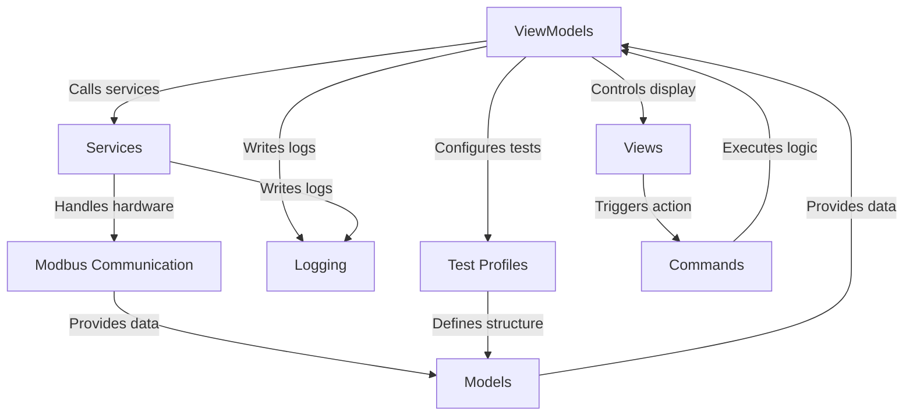
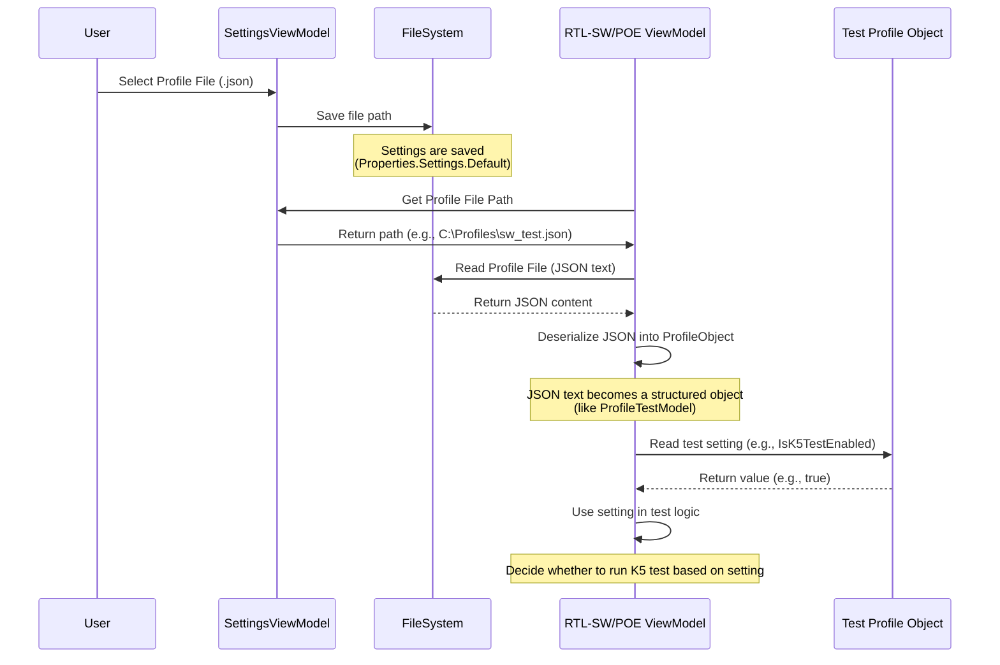
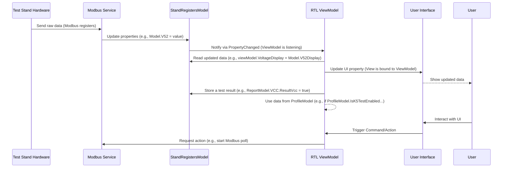
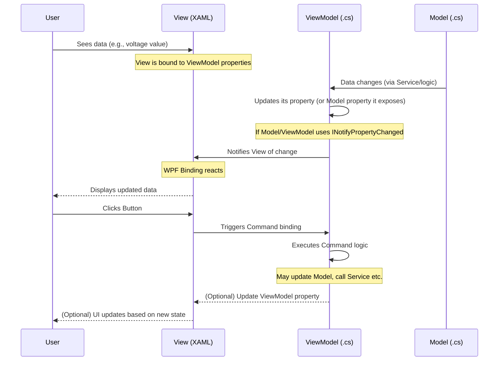
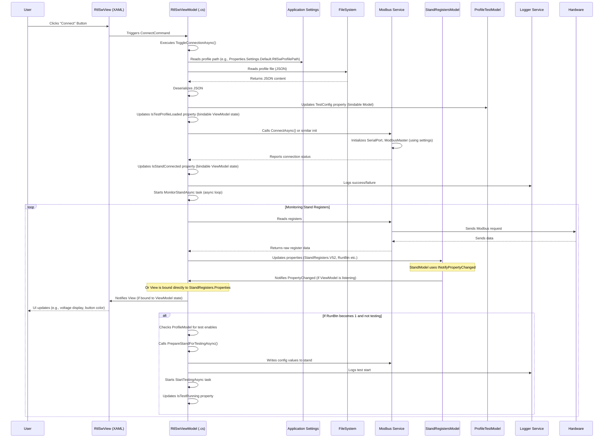
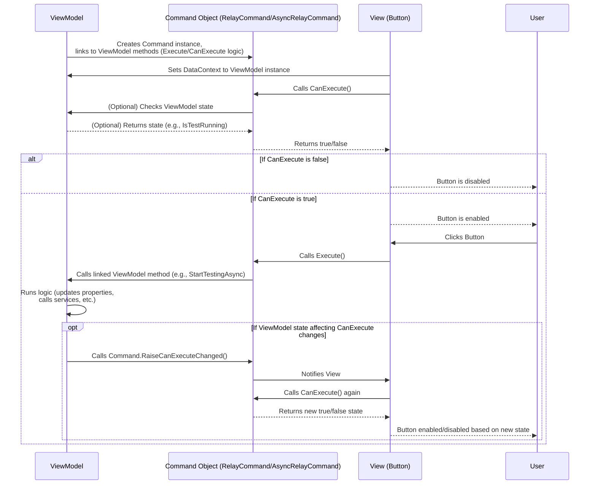
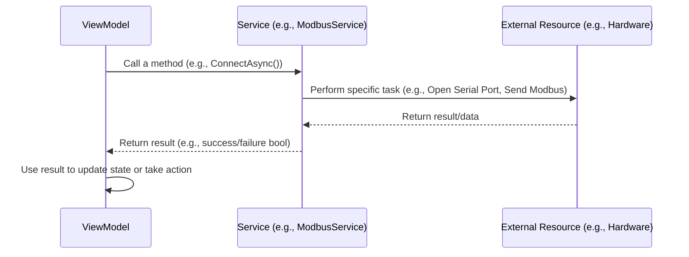
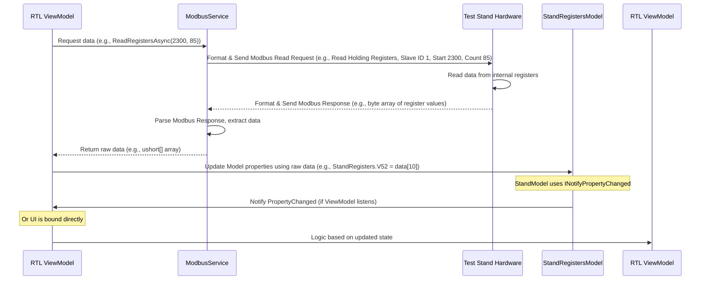
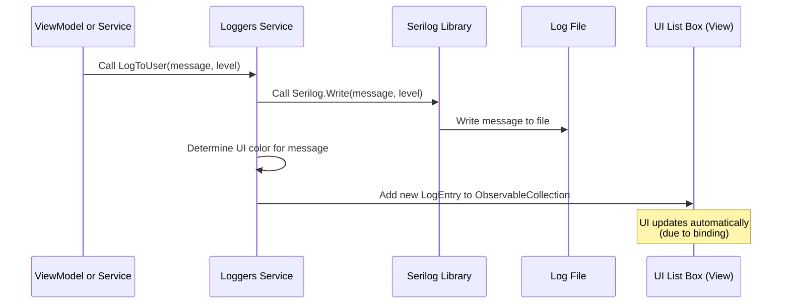

# Tutorial: RTL_v2

This project is a **test application** designed to interface with hardware **test stands** for different electronics boards. It allows users to **configure and run automated tests**, communicate with the hardware using *Modbus*, *log* events, generate *reports*, and *print labels* based on defined *test profiles*.


## Visual Overview



## Chapters

1. [Test Profiles
](01_test_profiles_.md)
2. [Models
](02_models_.md)
3. [Views
](03_views_.md)
4. [ViewModels
](04_viewmodels_.md)
5. [Commands
](05_commands_.md)
6. [Services
](06_services_.md)
7. [Modbus Communication
](07_modbus_communication_.md)
8. [Logging
](08_logging_.md)

---


# Chapter 1: Test Profiles

Welcome to the tutorial for the `RTL_v2` project! In this first chapter, we're going to learn about a fundamental concept called **Test Profiles**. Think of Test Profiles as the "instruction manuals" for our testing application.

## What's the Problem?

Our application needs to test different types of circuit boards, specifically `RTL-SW` and `RTL-POE`. These boards are different! They have different components, require different power levels, need different checks (like testing PoE ports or specific voltage regulators), and might have different flashing procedures.

How can one single application know exactly how to test each type of board without having separate versions for each?

This is where **Test Profiles** come in.

## What are Test Profiles?

A Test Profile is simply a **configuration file**. In our project, these files are written in a format called **JSON**.

Imagine you have a recipe book. Each recipe tells you what ingredients you need (parameters), how much of each ingredient (thresholds), and which steps to follow (enabled tests). A Test Profile is like a recipe for testing a specific type of board.

When you start testing a specific board (like an `RTL-SW`), the application doesn't have the test steps hardcoded inside it. Instead, it **loads** the Test Profile file that is meant for the `RTL-SW` board. This profile file contains all the instructions the application needs:

*   Which tests should be run? (Enable/Disable flags)
*   What are the expected voltage ranges? (Thresholds)
*   How long should the application wait between certain steps? (Delays)
*   Specific file paths needed for flashing, etc.

By using different Test Profile files, the *same* application can correctly test completely different types of boards!

## Test Profiles in Action: The User's View

As a user of the `RTL_v2` application, you will typically select the Test Profile file you want to use in the application's settings.

Let's look at a simplified view of the settings in the code.

```csharp
// --- File: ViewModels/SettingsViewModel.cs ---

// ... other properties ...

private string _rtlSwProfilePath;
public string RtlSwProfilePath
{
    get => _rtlSwProfilePath;
    set
    {
        if (SetAndNotify(ref _rtlSwProfilePath, value))
        {
            // When the path changes, save it for next time
            Properties.Settings.Default.RtlSwProfilePath = value;
            Properties.Settings.Default.Save();
        }
    }
}

private string _rtlPoeProfilePath;
public string RtlPoeProfilePath
{
    get => _rtlPoeProfilePath;
    set
    {
        if (SetAndNotify(ref _rtlPoeProfilePath, value))
        {
            // Save the path for the RTL-POE profile
            Properties.Settings.Default.RtlPoeProfilePath = value;
            Properties.Settings.Default.Save();
        }
    }
}

// ... other properties and commands ...

// Command to let the user select the RTL-SW profile file
public RelayCommand SelectRtlSwProfileCommand { get; }

// Command to let the user select the RTL-POE profile file
public RelayCommand SelectRtlPoeProfileCommand { get; }

public SettingsViewModel()
{
    // Load paths from saved settings when the application starts
    RtlSwProfilePath = Properties.Settings.Default.RtlSwProfilePath ?? string.Empty;
    RtlPoeProfilePath = Properties.Settings.Default.RtlPoeProfilePath ?? string.Empty;

    // Setup commands to open file dialogs
    SelectRtlSwProfileCommand = new RelayCommand(SelectRtlSwProfile);
    SelectRtlPoeProfileCommand = new RelayCommand(SelectRtlPoeProfile);
}

private void SelectRtlSwProfile()
{
    var dialog = new OpenFileDialog // This opens a file selection window
    {
        Filter = "JSON files (*.json)|*.json", // Only show .json files
        Title = "Select RTL-SW Profile"
    };
    if (dialog.ShowDialog() == true)
    {
        RtlSwProfilePath = dialog.FileName; // Update the property, which saves the setting
    }
}

private void SelectRtlPoeProfile()
{
     var dialog = new OpenFileDialog
     {
         Filter = "JSON files (*.json)|*.json",
         Title = "Select RTL-POE Profile"
     };
     if (dialog.ShowDialog() == true)
     {
         RtlPoeProfilePath = dialog.FileName; // Update the property, which saves the setting
     }
}
// ... rest of the class ...
```

This code snippet shows that the `SettingsViewModel` (which manages the application's settings screen) has properties (`RtlSwProfilePath`, `RtlPoeProfilePath`) to store the file paths of the selected profiles. When the user clicks a button (handled by `SelectRtlSwProfileCommand` or `SelectRtlPoeProfileCommand`), a file dialog pops up, allowing them to pick a `.json` file. The chosen path is then saved in the application's settings so it remembers it for next time.

This is how the *user* tells the application which "recipe book" to use for each board type.

## How Test Profiles Work Inside

When the application is ready to start testing a board (for example, when connecting to the test stand, as seen in the `RtlSwViewModel` and `RtlPoeViewModel` code), it needs to read the chosen profile file.

Here's a simplified sequence of what happens:



The ViewModel responsible for testing (`RtlSwViewModel` or `RtlPoeViewModel`) reads the saved file path. It then uses code to open the specified JSON file and read its contents.

Let's look at the code that does this loading in `RtlSwViewModel`:

```csharp
// --- File: ViewModels/RtlSwViewModel.cs ---

// ... other properties and methods ...

private ProfileTestModel _testConfig; // This will hold the loaded profile data

public ProfileTestModel TestConfig
{
    get => _testConfig;
    set => SetAndNotify(ref _testConfig, value); // Notify the UI when it changes
}

private bool _isTestProfileLoaded;
public bool IsTestProfileLoaded
{
    get => _isTestProfileLoaded;
    set => SetAndNotify(ref _isTestProfileLoaded, value);
}

private async Task<bool> TryLoadTestProfileAsync()
{
    try
    {
        // Get the file path from saved settings
        string testProfilePath = Properties.Settings.Default.RtlSwProfilePath;

        if (File.Exists(testProfilePath)) // Check if the file actually exists
        {
            // Read the entire file content as a string
            string json = await File.ReadAllTextAsync(testProfilePath);

            // Use Newtonsoft.Json to convert the JSON string into our C# object
            TestConfig = JsonConvert.DeserializeObject<ProfileTestModel>(json) ?? new ProfileTestModel();

            OnPropertyChanged(nameof(TestConfig)); // Notify the UI that the profile is ready
            IsTestProfileLoaded = true;
            _logger.LogToUser($"Test profile loaded successfully: {testProfilePath}", LogLevel.Success);
            return true;
        }
        else
        {
            // Handle case where the file is not found
            TestConfig = new ProfileTestModel(); // Create a default empty profile
            OnPropertyChanged(nameof(TestConfig));
            IsTestProfileLoaded = false;
            _logger.LogToUser($"Test profile file {testProfilePath} not found.", LogLevel.Warning);
            return false;
        }
    }
    catch (JsonException ex)
    {
        // Handle errors if the JSON is not valid
        TestConfig = new ProfileTestModel();
        OnPropertyChanged(nameof(TestConfig));
        IsTestProfileLoaded = false;
        _logger.LogToUser($"JSON parsing error: {ex.Message}", LogLevel.Error);
        return false;
    }
    catch (Exception ex)
    {
        // Handle any other errors during loading
        TestConfig = new ProfileTestModel();
        OnPropertyChanged(nameof(TestConfig));
        IsTestProfileLoaded = false;
        _logger.LogToUser($"Error loading test profile: {ex.Message}", LogLevel.Error);
        return false;
    }
}

// ... rest of the class ...
```

This method is called when the application connects to the stand. It retrieves the path from settings, reads the JSON file, and crucially, uses `JsonConvert.DeserializeObject` (from the Newtonsoft.Json library) to transform the text data into a `ProfileTestModel` object. This object (`TestConfig`) now holds all the structured settings defined in the profile file.

The `RtlPoeViewModel` has a very similar method (`TryLoadTestProfileAsync`) using `PoeTestProfileModel` and loading the path from `Properties.Settings.Default.RtlPoeProfilePath`.

## What's Inside the Profile Object?

The `ProfileTestModel` and `PoeTestProfileModel` classes define the structure of the data that comes from the JSON file. Each property in these classes corresponds to a setting in the JSON.

Let's look at a simplified version of `ProfileTestModel`:

```csharp
// --- File: Models/ProfileTestModel.cs ---
using Newtonsoft.Json;
// ... other usings ...

public class ProfileTestModel : INotifyPropertyChanged // It notifies UI if settings change
{
    // Properties match the JSON structure
    [JsonProperty("model_name")] // This links the property to the JSON key
    public string ModelName { get; set; }

    [JsonProperty("1.Проверка узла K5")] // JSON key for enabling the K5 test
    public bool IsK5TestEnabled { get; set; }

    [JsonProperty("k5_52V_min")] // Minimum expected voltage for 52V during K5 test
    public ushort K5_52V_Min { get; set; }

    [JsonProperty("k5_52V_max")] // Maximum expected voltage for 52V during K5 test
    public ushort K5_52V_Max { get; set; }

    // ... lots of other properties for voltages, delays, other test enables ...

    [JsonProperty("7. печать этикетки")] // JSON key for enabling label printing
    public bool IsLabelPrintingEnabled { get; set; }

    // ... PropertyChanged implementation ...
}
```

The `PoeTestProfileModel` is structured similarly but contains properties relevant to the PoE board tests (like `IsPoeTestRequired`, `V3v3Min`, `LedColour`, etc.).

The `[JsonProperty("...")]` part tells the `JsonConvert` how to match the keys in the JSON file (like `"k5_52V_min"`) to the properties in the C# class (`K5_52V_Min`).

## Using the Profile Settings in Tests

Once the `TestConfig` object (or `PoeTestProfileModel` in the other ViewModel) is loaded, the application's test logic uses the values from this object to control the test flow and check results.

For example, in `RtlSwViewModel.cs`, the `RunK5TestsAsync` method checks `TestConfig.IsK5TestEnabled` before running the K5 tests:

```csharp
// --- File: ViewModels/RtlSwViewModel.cs ---

// ... other code ...

private async Task<bool> RunK5TestsAsync(CancellationToken cancellationToken)
{
    // Check the setting from the loaded profile
    if (!TestConfig.IsK5TestEnabled)
    {
        _logger.LogToUser("K-5 test is disabled in the profile.", LogLevel.Warning);
        return true; // Skip the test but report it as "passed" in terms of workflow
    }

    _logger.LogToUser("Running K-5 node test...", LogLevel.Info);

    // ... test logic using TestConfig.K5TestDelay ...

    // Example of using a threshold from the profile during a K5 sub-test
    // (Simplified for clarity - the actual check is done by the stand firmware based on values sent to registers)
    // In the code, we send the min/max values *to* the stand before the test starts
    // as seen in PrepareStandForTestingAsync:
    // await WriteToRegisterWithRetryAsync(2333, TestConfig.K5_52V_Min);
    // await WriteToRegisterWithRetryAsync(2334, TestConfig.K5_52V_Max);

    // The stand then performs the check and reports pass/fail status back
    // which is then read and logged, as shown in RunSubTestK5Async:
    // _logger.LogToUser($"Measured results: 55V={report.V55Report}; 52V={report.V52Report}; ...", success ? LogLevel.Success : LogLevel.Error);

    return allSuccess;
}

// ... rest of the class ...
```

This pattern is repeated throughout the testing logic in both `RtlSwViewModel` and `RtlPoeViewModel`. Every time the application needs to know *whether* to run a test step, *what value* is acceptable, or *how long* to wait, it consults the loaded `TestConfig` (or `PoeTestProfileModel`).

## Summary

Test Profiles (JSON files) provide the `RTL_v2` application with flexible instructions for testing different board types (RTL-SW and RTL-POE). They define parameters, thresholds, and enabled tests. The application loads the appropriate profile based on user selection, converts the JSON data into a structured C# object (`ProfileTestModel` or `PoeTestProfileModel`), and uses this object to control the test execution. This allows the application to be highly adaptable without needing code changes for each new board variation or test requirement.

In the next chapter, we will dive deeper into the **Models** within the application, which are used not only for Test Profiles but also for representing other important data like the status of the test stand and the results of the tests.

[Chapter 2: Models](02_models_.md)

---

# Chapter 2: Models

Welcome back to the `RTL_v2` tutorial! In [Chapter 1: Test Profiles](01_test_profiles_.md), we learned how configuration files (Test Profiles) act like instruction manuals for our testing application, defining *what* tests to run and *what values* to expect. These profiles are loaded into special C# classes like `ProfileTestModel`.

But what exactly *are* these `ProfileTestModel` classes? And what about the data that represents the live status of the test stand, or the data that stores the final test results? This brings us to the concept of **Models**.

## What are Models?

In software development, especially in applications with a user interface like `RTL_v2`, we often follow a pattern called MVVM (Model-View-ViewModel). We'll learn about [Views](03_views_.md) and [ViewModels](04_viewmodels_.md) later, but for now, let's focus on **Models**.

Think of Models as the **data containers** of your application. They are simple classes or structures whose main job is to hold information. They represent the "things" or "nouns" in your application's world.

In `RTL_v2`, Models hold things like:

*   The current readings and status from the test stand hardware.
*   The results of the tests performed.
*   The configuration settings loaded from Test Profile files (as seen in Chapter 1).
*   Any other pieces of data the application needs to keep track of.

Models are generally **passive**. This means they don't usually contain complex logic that *does* things (like talking to hardware, performing calculations, or interacting with the user interface). Their primary role is just to **store data** and, sometimes, provide simple ways to access or format that data (like converting raw sensor values into a more human-readable format).

## Why Do We Need Models?

Imagine trying to build the application without these data containers. You'd have raw numbers and text floating around everywhere in the code, making it messy, hard to understand, and difficult to manage.

Models give structure to our data. By grouping related data into a class (like `StandRegistersModel` for all the test stand readings), we make the code cleaner and easier to work with. It's like organizing your ingredients in labeled containers in the kitchen instead of leaving them in piles on the counter.

The application needs a central place to hold the current status of the test stand, so different parts of the application can access it. It needs a defined structure to record test results consistently. It needs classes to represent the settings loaded from the profile. Models provide this structure and central storage.

## Examples of Models in RTL_v2

Let's look at some key Model classes in the `RTL_v2` project.

### 1. Representing Test Stand Status (`StandRegistersModel`, `PoeRegistersModel`)

The test stand hardware communicates with the application using Modbus ([Chapter 7: Modbus Communication](07_modbus_communication_.md)). It provides various readings like voltages, switch states, sensor values, and other status information, all as numbers (specifically, `ushort` values representing Modbus registers).

The `StandRegistersModel` (for the standard RTL-SW board) and `PoeRegistersModel` (for the RTL-POE board) are designed to hold these raw register values.

Here's a simplified look at `StandRegistersModel.cs`:

```csharp
// --- File: Models/StandRegistersModel.cs (Simplified) ---
using System.ComponentModel; // Needed for INotifyPropertyChanged
using System.Runtime.CompilerServices; // Needed for CallerMemberName

namespace RTL.Models
{
    public class StandRegistersModel : INotifyPropertyChanged // This allows the UI to react to changes
    {
        // Boilerplate code to notify UI when a property changes (more on this later)
        public event PropertyChangedEventHandler PropertyChanged;
        protected virtual void OnPropertyChanged([CallerMemberName] string propertyName = null)
        {
            PropertyChanged?.Invoke(this, new PropertyChangedEventArgs(propertyName));
        }
        private bool SetAndNotify<T>(ref T field, T value, [CallerMemberName] string propertyName = null)
        {
            if (EqualityComparer<T>.Default.Equals(field, value)) return false;
            field = value;
            OnPropertyChanged(propertyName);
            return true;
        }

        // Properties to hold data from the test stand registers
        private ushort _standSerialNumber;
        public ushort StandSerialNumber // Example: Holds the stand's serial number
        {
            get => _standSerialNumber;
            set => SetAndNotify(ref _standSerialNumber, value); // Update value and notify UI
        }

        private ushort _v52;
        public ushort V52 // Example: Holds the raw reading for 52V line
        {
            get => _v52;
            set
            {
                if (SetAndNotify(ref _v52, value))
                {
                    // Also notify that the 'Display' version might have changed
                    OnPropertyChanged(nameof(V52Display));
                }
            }
        }
        // A calculated property for displaying V52, maybe scaling or filtering raw data
        // (Still simple data access/formatting, not complex logic)
        public ushort V52Display => (_v52 > 56000 || _v52 < 1000) ? (ushort)0 : _v52;

        // ... many more properties for other registers like V55, Sensor1, RelayIn, etc. ...

        private ushort _rs485RxOk;
        public ushort RS485RxOK // Example: Status of RS485 communication
        {
            get => _rs485RxOk;
            set => SetAndNotify(ref _rs485RxOk, value);
        }
    }
}
```

Each property in `StandRegistersModel` corresponds directly to a value read from or written to the test stand's hardware registers via Modbus.

Notice the `INotifyPropertyChanged` stuff and the `SetAndNotify` method. While Models are generally passive, they often implement this interface. This is a standard way in .NET for an object to signal to listeners (like the user interface via [ViewModels](04_viewmodels_.md)) that one of its properties has changed. This is crucial for displaying live data; when the Modbus [Service](06_services_.md) updates `StandRegistersModel.V52`, the UI that is showing the V52 value automatically knows to update its display.

The `PoeRegistersModel` is very similar but contains properties specific to the PoE test stand's registers (like individual PoE port statuses, UART voltages, etc.).

### 2. Storing Test Results (`ReportModel`)

After a test is run, the application needs to record the results (Pass/Fail status, measured values for reporting). The `ReportModel` and its helper classes like `StageK5TestReport` are used for this:

```csharp
// --- File: Models/ReportModel.cs (Simplified) ---
// ... usings ...

namespace RTL.Models
{
    public class ReportModel
    {
        // Information about the test stand and the board under test
        public static int StandType { get; set; }
        public static int StandSerialNumber { get; set; }
        // ... board specific info ...

        // Grouped results for different test stages
        public static StageK5TestReport Stage1K5 { get; set; } = new StageK5TestReport();
        // ... Stage2K5, Stage3K5, Stage4K5, Stage5K5 ...

        public static VCCTestReport VCC { get; set; } = new VCCTestReport();

        public static FlashTestReport FlashReport { get; set; } = new FlashTestReport();

        // ... other test reports ...
    }

    // Helper class to group K5 stage results
    public class StageK5TestReport
    {
        public bool ResultK5 { get; set; } // Overall pass/fail for this stage
        public int V52Report { get; set; }  // Measured V52 value during this stage
        public int V55Report { get; set; }  // Measured V55 value during this stage
        // ... other voltage measurements for this stage ...
    }

    // Helper class to group VCC test results
    public class VCCTestReport
    {
        public bool ResultVcc { get; set; } // Overall pass/fail for VCC tests
        public int V33Report { get; set; }   // Measured 3.3V value
        public int V15Report { get; set; }   // Measured 1.5V value
        // ... other VCC related measurements ...
    }

    // Helper class for Flash results
    public class FlashTestReport
    {
        public bool FlashResult { get; set; } // Pass/Fail/Not Run
        public string FlashErrorMessage { get; set; } = string.Empty; // Details if failed
    }
}
```

`ReportModel` itself doesn't hold the individual measurements directly. Instead, it contains instances of other, smaller Model classes (`StageK5TestReport`, `VCCTestReport`, etc.) that group the results logically by test stage. This makes the data structure clean and organized.

Unlike `StandRegistersModel`, the properties in `ReportModel` and its helper classes don't implement `INotifyPropertyChanged`. This is because the test results are typically calculated and set *once* at the end of a test stage or the entire test run, rather than constantly changing live data.

### 3. Configuration Settings (`ProfileTestModel`, `PoeTestProfileModel`)

As we saw in [Chapter 1: Test Profiles](01_test_profiles_.md), the settings loaded from the JSON profile files are also stored in Model classes: `ProfileTestModel` and `PoeTestProfileModel`.

```csharp
// --- File: Models/ProfileTestModel.cs (Simplified) ---
// ... usings including Newtonsoft.Json ...

namespace RTL.Models
{
    public class ProfileTestModel : INotifyPropertyChanged // Can also notify if settings are changed *after* loading
    {
        // Properties matching JSON keys
        [JsonProperty("model_name")]
        public string ModelName { get; set; }

        [JsonProperty("1.Проверка узла K5")] // Setting for enabling/disabling K5 test
        public bool IsK5TestEnabled { get; set; }

        [JsonProperty("k5_52V_min")] // Minimum voltage threshold for K5 test
        public ushort K5_52V_Min { get; set; }

        // ... many other properties for thresholds, delays, enable flags ...

        [JsonProperty("7. печать этикетки")] // Setting for label printing
        public bool IsLabelPrintingEnabled { get; set; }

        // Boilerplate for INotifyPropertyChanged...
    }
}
```

These classes contain properties for every setting defined in the profile JSON. Again, they primarily just hold data. The `[JsonProperty(...)]` attributes are hints for the Newtonsoft.Json library, telling it which JSON key maps to which property in the C# class during the loading process we saw in Chapter 1.

### 4. Other Data Models (`FlashProgrammingContext`)

The project has other, less central Model classes used to hold specific sets of data. For example, `FlashProgrammingContext` holds all the necessary information for running the external flash programming tool:

```csharp
// --- File: Models/FlashProgrammingContext.cs (Simplified) ---
// ... usings ...

namespace RTL.Models
{
    public class FlashProgrammingContext
    {
        public string FlashProgramPath { get; set; } // Path to the flashing EXE
        public string ProjectFilePath { get; set; }  // Path to the project file (.mpj)
        public bool IsFirstRun { get; set; }         // Flag to show instruction first time
        public int FlashDelaySeconds { get; set; } = 180; // How long to wait
        public bool AutoMode { get; set; }      // Auto or manual mode
    }
}
```

This is another simple data container, grouping related pieces of information needed for a specific task (flashing).

## How Models Are Used

So, we have these classes holding different types of data. How do other parts of the application interact with them?

Models are typically created, updated, and read by [ViewModels](04_viewmodels_.md) and [Services](06_services_.md).



*   **[Services](06_services_.md)** (like the Modbus communication logic) are responsible for getting data from external sources (the test stand) and putting it *into* the appropriate Models (`StandRegistersModel`, `PoeRegistersModel`).
*   **[ViewModels](04_viewmodels_.md)** are the intermediaries between the [Views](03_views_.md) (what the user sees) and the Models. They read data *from* the Models to display it in the [View](03_views_.md). They might also write data *into* Models (like saving test results into `ReportModel`). [ViewModels](04_viewmodels_.md) also read configuration data from Models like `ProfileTestModel` to decide how to proceed with testing.

Let's see a tiny code example showing a [Service](06_services_.md) updating a Model and a [ViewModel](04_viewmodels_.md) using that Model.

First, the [Service](06_services_.md) receives data from the hardware and updates the Model:

```csharp
// --- Hypothetical Service Code (Simplified) ---
public class ModbusService // (Covered in Chapter 7)
{
    private StandRegistersModel _standRegisters; // Holds a reference to the Model

    public ModbusService(StandRegistersModel standRegisters)
    {
        _standRegisters = standRegisters; // Get the instance of the Model
    }

    // Method called when new data is received from the stand
    public void ProcessReceivedData(ushort[] registerValues)
    {
        // Update the Model properties with the new values
        // The specific index maps to the register address
        _standRegisters.StandSerialNumber = registerValues[0]; // Example mapping
        _standRegisters.V52 = registerValues[5]; // Example mapping
        // ... update all other properties ...
    }
}
```
*Explanation:* The `ModbusService` has a direct link to the `StandRegistersModel` instance. When it reads data from the hardware, it finds the correct place in the `StandRegistersModel` (e.g., the `V52` property) and updates its value. Because `StandRegistersModel` uses `SetAndNotify`, this change automatically alerts anything listening (like the [ViewModel](04_viewmodels_.md)).

Now, how the [ViewModel](04_viewmodels_.md) uses this Model:

```csharp
// --- Hypothetical ViewModel Code (Simplified) ---
public class RtlSwViewModel // (Covered in Chapter 4)
{
    // References to the Models it needs
    public StandRegistersModel StandRegisters { get; } // ViewModel holds the Model instance
    public ProfileTestModel TestConfig { get; }         // Holds the loaded profile config

    public ReportModel CurrentReport { get; }          // Holds the current test results

    // Properties the View will bind to, often getting data from Models
    public string StandStatusText => $"Serial: {StandRegisters.StandSerialNumber}";
    public string CurrentV52Reading => $"{StandRegisters.V52Display / 1000.0:F2} V"; // Reads from the Model

    public string OverallTestResult { get; set; } // Set by ViewModel based on ReportModel

    public RtlSwViewModel(StandRegistersModel standRegs, ProfileTestModel profileConfig, ReportModel report)
    {
        // ViewModel gets instances of the Models, often passed in
        StandRegisters = standRegs;
        TestConfig = profileConfig;
        CurrentReport = report;

        // The ViewModel might listen to the Model for updates
        // StandRegisters.PropertyChanged += (sender, args) => OnPropertyChanged(args.PropertyName); // Simplified connection
    }

    // Method to run a test step
    public async Task RunK5Test()
    {
        // Check the configuration setting from the Profile Model
        if (!TestConfig.IsK5TestEnabled)
        {
            // Test is disabled according to the profile, skip it.
            return;
        }

        // ... Perform test steps (may involve telling the Service to interact with hardware) ...

        // After test step, potentially update the Report Model with results
        CurrentReport.Stage1K5.ResultK5 = true; // Assume test passed
        CurrentReport.Stage1K5.V52Report = StandRegisters.V52; // Record the measured value
    }

    // ... other ViewModel logic ...
}
```
*Explanation:* The `RtlSwViewModel` keeps references to the `StandRegistersModel`, `ProfileTestModel`, and `ReportModel`.
*   It uses data from `StandRegistersModel` (`StandRegisters.StandSerialNumber`, `StandRegisters.V52Display`) to create properties (`StandStatusText`, `CurrentV52Reading`) that the user interface ([View](03_views_.md)) can display.
*   It reads settings from `ProfileTestModel` (`TestConfig.IsK5TestEnabled`) to decide whether to run a specific test.
*   After a test step, it writes the results into `ReportModel` (`CurrentReport.Stage1K5.ResultK5`, `CurrentReport.Stage1K5.V52Report`).

This shows how Models act as the central source of data that [Services](06_services_.md) update and [ViewModels](04_viewmodels_.md) read from and write to.

## Models are Passive

It's worth repeating: Models are generally passive data holders. They don't contain the *logic* for *how* to run a test, *how* to communicate via Modbus, or *how* to display data on the screen. That logic belongs in [ViewModels](04_viewmodels_.md) and [Services](06_services_.md).

Models are like simple data structures, defining the shape and type of the information. Their simplicity helps keep the application organized and makes it easier to change the business logic ([ViewModels](04_viewmodels_.md)) or how data is obtained ([Services](06_services_.md)) without affecting the core data representation itself.

## Conclusion

Models are fundamental building blocks in `RTL_v2`. They are simple classes primarily used to hold the application's data – whether it's live readings from the test stand (`StandRegistersModel`, `PoeRegistersModel`), configuration settings from profiles (`ProfileTestModel`, `PoeTestProfileModel`), or the results of tests (`ReportModel`). They are updated by [Services](06_services_.md) and used by [ViewModels](04_viewmodels_.md) to manage the application's state and interact with the user interface.

Now that we understand how data is structured and held in Models, let's look at the next piece of the puzzle: the user interface itself, the **Views**.

[Chapter 3: Views](03_views_.md)

---

# Chapter 3: Views

Welcome back! In the previous chapter, [Chapter 2: Models](02_models_.md), we learned that **Models** are the simple data containers in our application, holding information like test stand readings or profile settings. But raw data isn't very useful to a user unless they can see it and interact with it.

This is where **Views** come in.

## What's the Problem?

We have all this important data stored in our [Models](02_models_.md). We know the current voltage readings from the test stand, the status of different components, and the configuration settings loaded from the Test Profile. How do we show this information to the person using the application? How do we let them click a button to start a test, select a file path, or change a setting?

We need a user interface!

## What are Views?

**Views** are the part of the application that the user actually sees and interacts with. They are the visual elements displayed on the screen – things like windows, buttons, text boxes, labels, progress bars, and images.

Think of a View as the **"face" of the application**. It's what presents the information *to* the user and captures their input (like button clicks or text typed).

In our `RTL_v2` project, Views are primarily defined using **XAML** (eXtensible Application Markup Language). XAML is a special language for creating user interfaces in Windows Presentation Foundation (WPF), which is the technology our application uses for its UI.

## Views in `RTL_v2`: Looking at the XAML

You'll find the Views in the `Views` folder of the project. They are `.xaml` files, often paired with a very small `.xaml.cs` code-behind file.

Let's look at a small piece from `Views/SettingsView.xaml`. This file defines the visual layout of the application's settings screen.

```xml
<!-- --- File: Views/SettingsView.xaml (Snippet) --- -->
<UserControl x:Class="RTL.Views.SettingsView"
             xmlns="http://schemas.microsoft.com/winfx/2006/xaml/presentation"
             xmlns:x="http://schemas.microsoft.com/winfx/2006/xaml">
    
    <!-- This StackPanel arranges elements vertically -->
    <StackPanel Margin="10">
        
        <!-- A section for General Settings -->
        <Expander Header="Общие настройки" IsExpanded="True">
            <!-- StackPanel inside the expander -->
            <StackPanel Margin="10">
                <!-- A simple label -->
                <TextBlock Text="Папка для логов:" FontWeight="Bold"/>
                <!-- A horizontal arrangement -->
                <StackPanel Orientation="Horizontal">
                    <!-- A text box to display the log folder path -->
                    <TextBox Text="{Binding LogFolderPath, Mode=TwoWay}" Width="200" IsReadOnly="True"/>
                    <!-- A button to select the folder -->
                    <Button Content="Выбрать..." Command="{Binding SelectLogFolderCommand}" Margin="5,0,0,0"/>
                </StackPanel>
            </StackPanel>
        </Expander>

        <!-- Another section for RTL-SW settings -->
        <Expander Header="Настройки RTL-SW" IsExpanded="False">
            <StackPanel Margin="10">
                 <TextBlock Text="Профиль RTL-SW:" FontWeight="Bold"/>
                 <StackPanel Orientation="Horizontal">
                    <!-- Text box for RTL-SW profile path -->
                    <TextBox Text="{Binding RtlSwProfilePath, Mode=TwoWay}" Width="200" IsReadOnly="True"/>
                    <!-- Button to select RTL-SW profile -->
                    <Button Content="Выбрать..." Command="{Binding SelectRtlSwProfileCommand}" Margin="5,0,0,0"/>
                 </StackPanel>
                 <!-- ... other RTL-SW settings elements ... -->
            </StackPanel>
        </Expander>
        <!-- ... rest of the SettingsView UI ... -->
    </StackPanel>
</UserControl>
```
*Explanation:* This XAML code describes what the settings screen looks like. It uses elements like `StackPanel` to arrange things, `TextBlock` for labels, `TextBox` for showing or entering text, `Button` for actions, and `Expander` to create collapsable sections.

Notice that the XAML defines *visual elements* and their *layout*, but it doesn't contain code that says *how* to select a folder or *where* the `LogFolderPath` value comes from. That's the job of the [ViewModel](04_viewmodels_.md).

## Connecting Views to ViewModels: Data Binding and Commands

The core idea in the MVVM pattern (Model-View-ViewModel) that `RTL_v2` uses is that **Views should be as "dumb" as possible**. They shouldn't contain complex logic. Instead, they get the data they need to display *from* a [ViewModel](04_viewmodels_.md) and tell the [ViewModel](04_viewmodels_.md) *when* the user does something.

This connection between the View and its associated [ViewModel](04_viewmodels_.md) is achieved primarily through two mechanisms:

1.  **Data Binding:** Linking a UI element's property (like the `Text` of a `TextBlock`, the `Value` of a `ProgressBar`, or the `IsChecked` of a `ToggleButton`) directly to a property in the [ViewModel](04_viewmodels_.md). When the [ViewModel](04_viewmodels_.md) property changes, the View automatically updates.
2.  **Commands:** Linking interactive UI elements (like `Button`s or `ToggleButton`s) to **Commands** ([Chapter 5: Commands](05_commands_.md)) defined in the [ViewModel](04_viewmodels_.md). When the user interacts with the element (e.g., clicks a button), the associated command in the [ViewModel](04_viewmodels_.md) is executed.

Let's look at examples of Data Binding and Commands from the `RtlSwView.xaml`:

```xml
<!-- --- File: Views/RtlSwView.xaml (Snippet) --- -->
<!-- ... other XAML ... -->
    <Grid Grid.Column="1" Margin="10">
        <!-- ... other UI elements ... -->
            
        <!-- Border with control buttons -->
        <Border Grid.Column="0" Grid.Row="0" BorderThickness="2" CornerRadius="10" Padding="10">
            <StackPanel Orientation="Vertical">
                <!-- Connect Button -->
                <Button Width="150" Height="30" 
                        Command="{Binding ConnectCommand}" <!-- <<< Command Binding -->
                        ToolTip="Установка / прерывание связи со стендом"
                        Background="{Binding IsStandConnected, Converter={StaticResource BoolToColorConverter}}"> <!-- <<< Data Binding -->
                    <TextBlock Text="{Binding IsStandConnected, Converter={StaticResource BoolToTextConverter}}"/> <!-- <<< Data Binding -->
                </Button>

                <!-- Profile Load Button -->
                <StackPanel Orientation="Horizontal" Margin="0,5">
                    <Button Width="16" Height="16" 
                            Command="{Binding LoadTestProfileCommand}"> <!-- <<< Command Binding -->
                        <!-- Uses a custom template with a background bound to IsTestProfileLoaded -->
                        <Button.Template>
                            <ControlTemplate TargetType="{x:Type Button}">
                                <Border Background="{Binding IsTestProfileLoaded, Converter={StaticResource BoolToColorConverter}}"> <!-- <<< Data Binding inside Template -->
                                    <ContentPresenter HorizontalAlignment="Center" VerticalAlignment="Center"/>
                                </Border>
                            </ControlTemplate>
                        </Button.Template>
                    </Button>
                    <TextBlock Text="Профиль" VerticalAlignment="Center" Margin="10,0,0,0"/>
                </StackPanel>
                <!-- ... other status buttons using similar binding patterns ... -->
            </StackPanel>
        </Border>

        <!-- Power Control Expanders (Simplified) -->
        <Expander Grid.Row="0" Header="ПИТАНИЕ">
             <StackPanel Margin="5">
                 <!-- ToggleSwitch for V52 -->
                 <StackPanel Orientation="Horizontal" VerticalAlignment="Center">
                     <ToggleButton 
                         IsChecked="{Binding IsV52Enabled, Mode=TwoWay}" <!-- <<< Data Binding (Two-Way) -->
                         Style="{StaticResource SwitchButtonStyle}"/>
                     <TextBlock Text="V52"/>
                 </StackPanel>
                 <!-- ... V55 and Reset toggle buttons ... -->
             </StackPanel>
        </Expander>

        <!-- Voltage Readings Display (Simplified) -->
        <WrapPanel Grid.Column="0" Grid.Row="1" Grid.ColumnSpan="2">
             <!-- 52V Display -->
             <Border Width="150" Height="60" CornerRadius="10" Background="#1562FE" Margin="5">
                 <Grid>
                     <!-- ... layout elements ... -->
                     <StackPanel Grid.Column="1">
                         <!-- Displaying live 52V reading from the Model via ViewModel -->
                         <TextBlock Text="{Binding StandRegisters.V52Display}"  /><!-- <<< Data Binding -->
                         <!-- Displaying thresholds from the Profile Model via ViewModel -->
                         <StackPanel Orientation="Horizontal">
                             <TextBlock Text="{Binding TestConfig.K5_52V_Min}" /><!-- <<< Data Binding -->
                             <TextBlock Text=" - "/>
                             <TextBlock Text="{Binding TestConfig.K5_52V_Max}" /><!-- <<< Data Binding -->
                         </StackPanel>
                     </StackPanel>
                 </Grid>
             </Border>
             <!-- ... other voltage displays ... -->
        </WrapPanel>
        <!-- ... rest of the RtlSwView UI ... -->
    </Grid>
<!-- ... other XAML ... -->
```

*Explanation:*
*   `Command="{Binding ConnectCommand}"`: This line tells the button, "When you are clicked, find the property named `ConnectCommand` on my associated [ViewModel](04_viewmodels_.md) and execute it." The `ConnectCommand` property in the [ViewModel](04_viewmodels_.md) will be an object that knows how to handle the connection logic.
*   `Background="{Binding IsStandConnected, Converter={StaticResource BoolToColorConverter}}"` and `Text="{Binding IsStandConnected, Converter={StaticResource BoolToTextConverter}}"`: These lines tell the UI elements, "Get your `Background` and `Text` values from the `IsStandConnected` property on my associated [ViewModel](04_viewmodels_.md). Use the specified `Converter` to change the `bool` value into a color or text." When the [ViewModel](04_viewmodels_.md) updates the `IsStandConnected` property (which happens when the connection status changes), the button's appearance and text update automatically.
*   `IsChecked="{Binding IsV52Enabled, Mode=TwoWay}"`: This links the state of the toggle switch directly to the `IsV52Enabled` property in the [ViewModel](04_viewmodels_.md). `Mode=TwoWay` means that if the user clicks the toggle (changing its `IsChecked` state), the `IsV52Enabled` property in the [ViewModel](04_viewmodels_.md) is *also* updated. If the [ViewModel](04_viewmodels_.md) changes `IsV52Enabled`, the toggle state updates.
*   `Text="{Binding StandRegisters.V52Display}"`: This shows how the View can display data from a [Model](02_models_.md) (`StandRegisters`) by accessing it through a property in the [ViewModel](04_viewmodels_.md). The [ViewModel](04_viewmodels_.md) exposes the `StandRegisters` [Model](02_models_.md) instance, and the View binds to a property on that [Model](02_models_.md).
*   `Text="{Binding TestConfig.K5_52V_Min}"`: Similarly, this binds to data stored in the `TestConfig` [Model](02_models_.md), which is also exposed by the [ViewModel](04_viewmodels_.md).

The `DataContext` (usually set in the code that creates the View and [ViewModel](04_viewmodels_.md)) is what tells the View *which* [ViewModel](04_viewmodels_.md) instance these `Binding`s should look at.

This is how the View stays focused on just displaying things and handling user clicks, while the [ViewModel](04_viewmodels_.md) handles *what* data to show and *what* to do when something is clicked.

Here's a simplified flow:



## Views and Code-Behind

As mentioned, the goal is minimal code-behind (`.xaml.cs` files). Ideally, the `.xaml.cs` file for a View would contain *only* the `InitializeComponent()` call, which is needed to load the XAML definition.

```csharp
// --- File: Views/SettingsView.xaml.cs ---
using System.Windows.Controls;

namespace RTL.Views
{
    public partial class SettingsView : UserControl
    {
        public SettingsView()
        {
            InitializeComponent(); // Loads the XAML
        }
    }
}
```
*Explanation:* This is the standard, minimal code-behind. Everything else (data display, button actions) is handled via XAML bindings to the [ViewModel](04_viewmodels_.md).

Sometimes, you *do* need a little bit of code-behind. This is usually for things that are purely related to the UI's behavior and are difficult or impossible to do in XAML or the [ViewModel](04_viewmodels_.md). A common case is handling UI element events that aren't easily mapped to a simple command, or needing a reference to a specific UI control *within* the [ViewModel](04_viewmodels_.md) (though this is often considered breaking the MVVM pattern slightly and should be used sparingly).

Look at the `RtlSwView.xaml.cs`:

```csharp
// --- File: Views/RtlSwView.xaml.cs ---
using RTL.ViewModels; // Need this to access the ViewModel type
using System.Windows.Controls; // Need this for ListBox
using System.Windows; // Need this for Loaded event

namespace RTL.Views
{
    public partial class RtlSwView : UserControl
    {
        public RtlSwView()
        {
            InitializeComponent(); // Loads the XAML

            // This code runs when the View has finished loading
            Loaded += (s, e) =>
            {
                // Check if the DataContext (the ViewModel) is of the expected type
                if (DataContext is RtlSwViewModel vm)
                {
                    // Pass a reference to the ListBox UI element to the ViewModel
                    // This allows the ViewModel (or code it calls) to add items to the log display.
                    vm.SetLogListBox(LogListBox);
                }
            };
        }
    }
}
```
*Explanation:* Here, the code-behind adds a handler for the `Loaded` event. When the `RtlSwView` is loaded and displayed, this code runs. It accesses the `DataContext` (which is the `RtlSwViewModel` instance) and calls a method `SetLogListBox` on it, passing a reference to the `LogListBox` control defined in the XAML. This is necessary because adding items to a `ListBox` is a specific UI operation, and the [ViewModel](04_viewmodels_.md) needs to tell the UI layer *which* `ListBox` to add logs to. While passing UI controls to ViewModels is sometimes debated in MVVM circles, in this project, it's used specifically for the logging output ListBox for simplicity.

This demonstrates that code-behind is used *only* when interacting directly with the UI framework (`ListBox` control, `Loaded` event). All the actual logic for *what* to log or *when* to add a log message remains in the [ViewModel](04_viewmodels_.md) or other layers.

## Summary

**Views** are the visual part of the `RTL_v2` application, defining the user interface using XAML. They are responsible for:

*   Displaying data, getting values from the [ViewModel](04_viewmodels_.md) via **Data Binding**.
*   Capturing user interaction (like button clicks) and communicating it to the [ViewModel](04_viewmodels_.md) via **Commands**.

Views should contain minimal code-behind logic, focusing mainly on UI initialization or specific UI interactions that cannot be handled declaratively in XAML. This separation keeps the UI clean and makes the application's logic easier to manage in the [ViewModel](04_viewmodels_.md).

Now that we've explored the "face" of the application, let's move on to the "brain" that controls it – the **ViewModels**.

[Chapter 4: ViewModels](04_viewmodels_.md)

---
# Chapter 4: ViewModels

Welcome back to the `RTL_v2` tutorial! In the previous chapters, we looked at the building blocks of our application: [Chapter 1: Test Profiles](01_test_profiles_.md) (configuration data), [Chapter 2: Models](02_models_.md) (data containers), and [Chapter 3: Views](03_views_.md) (the user interface).

Now, we need something to connect these pieces. How does the user interface (the View) know what data to display from the Models? How does clicking a button in the View trigger the right action, like starting a test, which might involve using a [Service](06_services_.md) to talk to hardware and then updating a [Model](02_models_.md) with the results?

This is the job of the **ViewModels**.

## What are ViewModels?

ViewModels are the **"brains"** behind each screen or part of the user interface in our application. They act as intermediaries, sitting between the [Views](03_views_.md) and the [Models](02_models_.md) (and interacting with [Services](06_services_.md)).

Think of the ViewModel as the **conductor of an orchestra**:

*   It doesn't play any instruments itself (it doesn't create the visual elements like buttons or text boxes – that's the [View](03_views_.md)'s job).
*   It doesn't hold all the sheet music (it gets the data it needs from the [Models](02_models_.md)).
*   But it **directs** everything. It decides *what* data should be shown by the [View](03_views_.md) and *when*, and it knows *what to do* when an instrument signals something (like a user clicking a button in the [View](03_views_.md)).

In the MVVM (Model-View-ViewModel) pattern, the ViewModel is responsible for:

1.  **Holding the state for the View:** It has properties that represent the data or state the [View](03_views_.md) needs to display (like "Is the stand connected?", "What's the current voltage reading?", "What's the progress percentage?", "Is this test enabled?").
2.  **Exposing data from Models:** It often exposes data from underlying [Models](02_models_.md) so the [View](03_views_.md) can easily access it via data binding.
3.  **Handling user actions:** It contains the logic to be executed when the user interacts with the [View](03_views_.md) (e.g., what happens when the "Connect" button is clicked?). These actions are exposed to the [View](03_views_.md) through **Commands** ([Chapter 5: Commands](05_commands_.md)).
4.  **Interacting with Services:** It calls upon [Services](06_services_.md) ([Chapter 6: Services](06_services_.md)) to perform tasks like communicating with hardware, saving data, or logging.
5.  **Updating Models:** It updates the state of [Models](02_models_.md) based on user actions or responses from [Services](06_services_.md).

Crucially, a ViewModel **knows nothing about the specific visual elements** (buttons, text boxes, labels, etc.) in the [View](03_views_.md). This separation makes ViewModels easier to test and reuse. You could, in theory, swap out the WPF [View](03_views_.md) for a completely different UI technology, and the ViewModel logic could remain largely the same.

## ViewModels in `RTL_v2`

In `RTL_v2`, you'll find ViewModel classes in the `ViewModels` folder. Each major screen or functional area of the application typically has its own ViewModel:

*   `MainViewModel`: Manages which main screen ([View](03_views_.md)) is currently visible.
*   `SettingsViewModel`: Manages the data and logic for the application settings screen.
*   `RtlSwViewModel`: Manages the data and logic for the RTL-SW testing screen.
*   `RtlPoeViewModel`: Manages the data and logic for the RTL-POE testing screen.

Let's focus on the `RtlSwViewModel` as a concrete example, as it ties together many concepts we've discussed.

## Connecting Views and ViewModels

As we touched upon in [Chapter 3: Views](03_views_.md), the connection between a [View](03_views_.md) and its ViewModel is done through **Data Binding** and **Commands**. The [View](03_views_.md) defines *what* visual elements exist and *how* they are laid out, and uses binding expressions (`{Binding ...}`) to link their properties (like `Text`, `Background`, `IsChecked`) to properties on the ViewModel, and link interactive elements (`Button.Command`) to Commands on the ViewModel.

The WPF framework uses the `DataContext` property of a [View](03_views_.md) (or any UI element) to know *which* ViewModel instance to look at when resolving these `{Binding ...}` expressions. When the application starts, code (specifically in `Bootstrapper.cs`, part of the Stylet framework used) sets up this connection, creating instances of ViewModels and assigning them as the `DataContext` for their corresponding [Views](03_views_.md).

## Inside a ViewModel: Properties

ViewModels contain properties that the [View](03_views_.md) binds to. These properties often store UI-specific state or expose data from [Models](02_models_.md).

Here's a simplified look at some properties in `RtlSwViewModel`:

```csharp
// --- File: ViewModels/RtlSwViewModel.cs (Snippet) ---

// ... other code ...

private bool _isStandConnected;
public bool IsStandConnected // Property for UI to show connection status
{
    get => _isStandConnected;
    set => SetAndNotify(ref _isStandConnected, value); // Updates value and notifies UI
}

private bool _isTestRunning;
public bool IsTestRunning // Property for UI to enable/disable buttons, show status
{
    get => _isTestRunning;
    set => SetAndNotify(ref _isTestRunning, value);
}

private int _progressValue;
public int ProgressValue // Property for UI to show test progress bar value
{
    get => _progressValue;
    set => SetAndNotify(ref _progressValue, value);
}

// Exposes the StandRegistersModel so the View can bind directly to its properties
public StandRegistersModel StandRegisters { get; } = new StandRegistersModel();

// Exposes the loaded ProfileTestModel so the View can bind to configuration settings
public ProfileTestModel TestConfig { get; set; } // Simplified - actual uses SetAndNotify

// ... other properties ...

// Helper method often used by properties to raise PropertyChanged
protected virtual void OnPropertyChanged(string propertyName = null)
{
    PropertyChanged?.Invoke(this, new PropertyChangedEventArgs(propertyName));
}

private bool SetAndNotify<T>(ref T field, T value, string propertyName = null)
{
    if (EqualityComparer<T>.Default.Equals(field, value)) return false;
    field = value;
    OnPropertyChanged(propertyName);
    return true;
}

// ... rest of the class ...
```
*Explanation:*
*   `IsStandConnected`, `IsTestRunning`, `ProgressValue` are examples of properties that hold the state specifically needed by the UI. When their values change, `SetAndNotify` is called, which triggers the `PropertyChanged` event. The [View](03_views_.md) (if bound to these properties) listens for this event and updates the display accordingly.
*   `StandRegisters` and `TestConfig` are properties that hold instances of [Model](02_models_.md) classes. The View can bind directly to properties *within* these models (e.g., `{Binding StandRegisters.V52Display}` or `{Binding TestConfig.IsK5TestEnabled}`). This is a common pattern to expose complex data structures from the ViewModel to the View.
*   `SetAndNotify` is a common helper method that updates the internal field (`ref T field`) and then calls `OnPropertyChanged()` if the value actually changed. This pattern is key for data binding to work.

## Inside a ViewModel: Commands

ViewModels contain the logic for user actions, exposed as **Commands**. In `RTL_v2`, the `RelayCommand` and `AsyncRelayCommand` classes are used (we'll learn more about them in [Chapter 5: Commands](05_commands_.md)). These commands wrap methods that contain the actual logic to be performed.

Here's how commands are set up in `RtlSwViewModel`:

```csharp
// --- File: ViewModels/RtlSwViewModel.cs (Snippet) ---

// ... other properties and code ...

// Command to connect/disconnect from the stand
public ICommand ConnectCommand { get; }

// Command to load the test profile manually (though it's also loaded automatically)
public ICommand LoadTestProfileCommand { get; }

// Command to manually open the Flash programming program
public ICommand OpenFlashProgramCommand { get; }

// ... other commands ...

public RtlSwViewModel(Loggers logger, ReportService report) // Constructor
{
    // ... dependency injection (getting instances of Services and possibly Models) ...

    // Assign the commands to the methods they should execute
    ConnectCommand = new AsyncRelayCommand(ToggleConnectionAsync); // Links Command to method
    LoadTestProfileCommand = new RelayCommand(async () => await TryLoadTestProfileAsync());
    OpenFlashProgramCommand = new AsyncRelayCommand(OpenFlashProgramAsync, () => true);

    // ... rest of constructor ...
}

// Method executed when ConnectCommand is triggered
private async Task ToggleConnectionAsync()
{
    if (IsStandConnected) // Check current state (from ViewModel property)
    {
        await DisconnectStand(); // Call internal method
        IsStandConnected = false; // Update ViewModel property
    }
    else
    {
        _logger.LogToUser("Попытка подключения к стенду...", Loggers.LogLevel.Info); // Call Service
        // ... other logic, potentially calling Services and updating Models/Properties ...
        if (await TryInitializeModbusAsync()) // Call internal method
        {
             IsStandConnected = true; // Update ViewModel property
             // ... start monitoring, logging, etc. ...
        }
    }
}

// Method executed when LoadTestProfileCommand is triggered
private async Task<bool> TryLoadTestProfileAsync()
{
    // ... logic to load profile from file (using File I/O - not a Service here for simplicity) ...
    // ... uses Properties.Settings.Default.RtlSwProfilePath (configuration) ...
    // ... deserializes JSON using JsonConvert ...
    TestConfig = JsonConvert.DeserializeObject<ProfileTestModel>(json); // Updates Model property exposed by ViewModel
    IsTestProfileLoaded = TestConfig != null; // Updates ViewModel property
    // ... logging via _logger (Service) ...
    return IsTestProfileLoaded;
}

// ... other command methods ...
```
*Explanation:*
*   The `ConnectCommand`, `LoadTestProfileCommand`, etc., are declared as properties of type `ICommand`.
*   In the ViewModel's constructor, these properties are assigned new instances of `RelayCommand` or `AsyncRelayCommand`, passing the method that should be executed when the command is triggered by the [View](03_views_.md). For example, clicking the "Connect" button (bound to `ConnectCommand`) calls the `ToggleConnectionAsync` method.
*   The methods (`ToggleConnectionAsync`, `TryLoadTestProfileAsync`, etc.) contain the actual logic. This logic manipulates ViewModel properties (`IsStandConnected`, `IsTestProfileLoaded`), updates [Models](02_models_.md) (`TestConfig`), and calls [Services](06_services_.md) (`_logger`, `_modbusService` implicitly via helper methods like `WriteToRegisterWithRetryAsync`).

## ViewModel Orchestration: A Test Start Example

Let's trace what happens when the user clicks the "Connect" button in the `RtlSwView`, leading to the system starting to monitor the stand and prepare for a test.


*Explanation:* This diagram illustrates the flow. The View initiates the action by triggering a Command on the ViewModel. The ViewModel then orchestrates everything: loading configuration (from Settings/FileSystem into a [Model](02_models_.md)), connecting to hardware (via a [Service](06_services_.md)), updating its own state properties (`IsStandConnected`, `IsTestProfileLoaded`), starting background tasks (like monitoring), and logging progress (via a [Service](06_services_.md)). The monitoring loop shows how the [Service](06_services_.md) updates the [Model](02_models_.md), and this change propagates back up to the View via binding, potentially involving ViewModel properties as intermediaries. When the `RunBtn` in the `StandRegistersModel` changes, the monitoring logic in the ViewModel detects this and triggers the test start sequence.

## ViewModels and Code-Behind (Revisited)

In [Chapter 3: Views](03_views_.md), we saw that the `RtlSwView.xaml.cs` code-behind contained a small piece of code to pass the `LogListBox` UI element to the ViewModel using `vm.SetLogListBox(LogListBox);`.

```csharp
// --- File: Views/RtlSwView.xaml.cs (Snippet) ---
// ... usings ...
using System.Windows.Controls; // Need this for ListBox

namespace RTL.Views
{
    public partial class RtlSwView : UserControl
    {
        public RtlSwView()
        {
            InitializeComponent(); // Loads the XAML

            // This code runs when the View has finished loading
            Loaded += (s, e) =>
            {
                // Check if the DataContext (the ViewModel) is of the expected type
                if (DataContext is RtlSwViewModel vm)
                {
                    // Pass a reference to the ListBox UI element to the ViewModel
                    vm.SetLogListBox(LogListBox); // <<< Passing UI element to ViewModel
                }
            };
        }
    }
}
```
*Explanation:* This is a rare case where the ViewModel needs to know about a specific UI control type (`ListBox`) because the logging mechanism in this project involves directly adding items to this visual list. Ideally, ViewModels shouldn't have this knowledge. A more "pure" MVVM approach might involve the ViewModel exposing an `ObservableCollection<LogEntry>` property, and the View binding its `ItemsSource` to this collection. However, the `SetLogListBox` approach is used here for simplicity in integrating the existing logging mechanism (`Loggers` class). This highlights that while the goal is strict separation, sometimes practical considerations lead to minor deviations.

The ViewModel method that receives this reference looks like this:

```csharp
// --- File: ViewModels/RtlSwViewModel.cs (Snippet) ---
// ... other code ...

private ListBox _logListBox; // ViewModel holds a reference to the View's ListBox

public void SetLogListBox(ListBox listBox) // Method called by the View's code-behind
{
    _logListBox = listBox;
    if (_logListBox != null)
    {
        // When the ListBox is set, subscribe to the Logs collection changes
        Logs.CollectionChanged += ScrollToEnd;
    }
}

// Method called when the Logs collection (in the Logger Service) changes
private void ScrollToEnd(object sender, NotifyCollectionChangedEventArgs e)
{
    if (_logListBox != null && _logListBox.Items.Count > 0)
    {
        // Use the Dispatcher to interact with the UI element on the UI thread
        _logListBox.Dispatcher.BeginInvoke(() =>
        {
            _logListBox.ScrollIntoView(_logListBox.Items[_logListBox.Items.Count - 1]);
        }, DispatcherPriority.Background);
    }
}
// ... rest of the class ...
```
*Explanation:* The ViewModel stores the reference to the `ListBox`. When a new log message arrives (and is added to the `Logs` collection, which is managed by the `Loggers` [Service](06_services_.md)), the `CollectionChanged` event fires. The ViewModel's `ScrollToEnd` method handles this event and uses the stored `_logListBox` reference to tell the specific UI element to scroll to the latest item. The use of `Dispatcher.BeginInvoke` is necessary because updating UI elements can only be done on the UI thread, but the `CollectionChanged` event might be triggered from a background thread (e.g., the Modbus monitoring thread).

This demonstrates the ViewModel's role in managing the application's state and logic, even in cases where it needs a direct link back to the UI to perform specific UI manipulations.

## Summary

ViewModels are the operational core of the `RTL_v2` application's UI layer. They are the "brains" that contain the state and logic required by the [Views](03_views_.md). They expose properties for [Views](03_views_.md) to bind to (including data from [Models](02_models_.md)) and **Commands** for [Views](03_views_.md) to trigger actions. ViewModels interact with [Services](06_services_.md) to perform operations like communicating with hardware, and they update [Models](02_models_.md) based on results. This architecture keeps the complex logic separate from the visual definition of the [View](03_views_.md), making the application more organized, maintainable, and testable.

Now that we understand the ViewModel's role in orchestrating the application, let's delve deeper into the mechanism ViewModels use to expose actions to the View: **Commands**.

[Chapter 5: Commands](05_commands_.md)
# Chapter 5: Commands

Welcome back to the `RTL_v2` tutorial! In [Chapter 4: ViewModels](04_viewmodels_.md), we explored how **ViewModels** act as the central logic hub, holding state and orchestrating actions. But how exactly does the **View** (the user interface) tell the **ViewModel** that something happened, like a button being clicked, so the ViewModel can perform the corresponding action?

This is where **Commands** come in.

## What's the Problem?

Imagine you have a button in your application that, when clicked, needs to start a test sequence. The visual definition of the button is in the [View (XAML)](03_views_.md). The logic for *starting the test* (talking to hardware, updating progress, etc.) lives in the [ViewModel](04_viewmodels_.md).

A simple way might be to handle the button's `Click` event directly in the [View's code-behind](03_views_.md) (`.xaml.cs`) and then call a method on the ViewModel.

```csharp
// --- View's Code-Behind (RtlSwView.xaml.cs) - DON'T DO THIS IN MVVM! ---
public partial class RtlSwView : UserControl
{
    public RtlSwView()
    {
        InitializeComponent();
    }

    // Event handler for the button click
    private void StartTestButton_Click(object sender, RoutedEventArgs e)
    {
        // Directly call a method on the ViewModel (assuming DataContext is the ViewModel)
        if (DataContext is RtlSwViewModel vm)
        {
            vm.StartTestingSequence(); // Calling ViewModel logic from UI code
        }
    }
}
```

This works, but it breaks the MVVM principle of keeping the View and ViewModel separate. The View's code-behind now knows about the ViewModel's methods and how to call them. This makes the View less "dumb" and harder to manage, especially for complex UIs.

Also, consider how to *disable* the button when the test is already running. You'd need more code in the View's code-behind to listen for a property change on the ViewModel (`IsTestRunning`) and update the button's `IsEnabled` property accordingly.

```csharp
// --- Still in View's Code-Behind - More code to manage state! ---
public RtlSwView()
{
    InitializeComponent();

    if (DataContext is RtlSwViewModel vm)
    {
        // Listen for ViewModel property changes
        vm.PropertyChanged += Vm_PropertyChanged;
        // Set initial state
        UpdateButtonState(vm.IsTestRunning);
    }
}

private void Vm_PropertyChanged(object sender, PropertyChangedEventArgs e)
{
    if (e.PropertyName == nameof(RtlSwViewModel.IsTestRunning))
    {
        if (sender is RtlSwViewModel vm)
        {
            // Update button state on the UI thread
            Dispatcher.Invoke(() => UpdateButtonState(vm.IsTestRunning));
        }
    }
}

private void UpdateButtonState(bool isTestRunning)
{
    StartTestButton.IsEnabled = !isTestRunning;
}
```

This is becoming complicated for a simple button! We need a cleaner way to link UI actions to ViewModel logic and manage the UI element's enabled state automatically.

## What are Commands?

**Commands** provide a standard, structured way to handle actions in WPF (and other XAML-based frameworks) that fits perfectly with the MVVM pattern.

A Command is essentially an **object** that represents an action (like "Start Test", "Save Settings", "Connect"). This object knows two main things:

1.  **How to execute the action** (`Execute`).
2.  **Whether the action can currently be executed** (`CanExecute`).

The UI element (like a `Button` or `MenuItem`) doesn't need to know *how* to perform the action. It simply binds its `Command` property to a Command object exposed by the ViewModel. When the user interacts with the UI element (e.g., clicks the button), the UI framework calls the Command object's `Execute` method.

The UI element also checks the Command object's `CanExecute` method. If `CanExecute` returns `false`, the UI element (like a button) automatically disables itself.



This diagram shows the core flow: the View asks the Command if it *can* execute (which might involve the ViewModel's state), and if the user clicks, the View tells the Command to *execute* (which calls the ViewModel's logic). The `RaiseCanExecuteChanged` mechanism ensures the UI updates automatically when the underlying state changes.

## `ICommand` Interface

In WPF, Commands implement the standard `System.Windows.Input.ICommand` interface. This interface defines the three key members:

*   `void Execute(object parameter)`: The method that is called when the command is triggered. The `parameter` can pass extra information (though often unused in simple cases).
*   `bool CanExecute(object parameter)`: The method that determines if the command is currently available.
*   `event EventHandler CanExecuteChanged`: An event that should be raised whenever the value returned by `CanExecute` *might* have changed.

## `RTL_v2`'s Command Implementations: `RelayCommand` and `AsyncRelayCommand`

While you could create a new class implementing `ICommand` for *every single action* in your ViewModel, this would lead to a lot of repetitive code. Common practice is to use generic implementations. `RTL_v2` uses two such classes:

1.  **`RelayCommand`**: Used for simple, synchronous actions that complete immediately and don't need to prevent multiple clicks. It wraps an `Action` delegate for the `Execute` part and an optional `Func<bool>` for the `CanExecute` part.
2.  **`AsyncRelayCommand`**: Used for asynchronous actions (`async Task`) that might take some time (like I/O operations, Modbus communication, network requests). It wraps a `Func<Task>`. Crucially, it includes logic to prevent the command from being executed again while it's already running, which is important for async operations. It also has an optional `Func<bool>` for `CanExecute`.

You'll find the code for these in the `Commands` folder: `RelayCommand.cs` and `AsyncRelayCommand.cs`.

## How ViewModels Use Commands

ViewModels in `RTL_v2` expose actions as properties of type `ICommand` and initialize them in their constructors using `RelayCommand` or `AsyncRelayCommand`.

Let's look at snippets from `SettingsViewModel.cs`:

```csharp
// --- File: ViewModels/SettingsViewModel.cs (Snippet) ---
// ... other usings ...
using RTL.Commands; // Need access to our custom command classes
using System.Windows.Input; // Need ICommand

public class SettingsViewModel : Screen
{
    // ... other properties like LogFolderPath, RtlSwProfilePath ...

    // Command properties exposed to the View
    public RelayCommand SelectLogFolderCommand { get; }
    public RelayCommand SelectRtlSwProfileCommand { get; }
    public RelayCommand SelectRtlPoeProfileCommand { get; }
    // ... other commands ...

    public SettingsViewModel()
    {
        // Constructor initializes the commands
        SelectLogFolderCommand = new RelayCommand(SelectLogFolder); // Link to a method
        SelectRtlSwProfileCommand = new RelayCommand(SelectRtlSwProfile);
        SelectRtlPoeProfileCommand = new RelayCommand(SelectRtlPoeProfile);
        // ... initialize other commands ...
    }

    // The methods executed by the commands
    private void SelectLogFolder()
    {
        // Logic to open folder browser and update LogFolderPath
        var dialog = new CommonOpenFileDialog { IsFolderPicker = true };
        if (dialog.ShowDialog() == CommonFileDialogResult.Ok)
        {
            LogFolderPath = dialog.FileName; // Update ViewModel property
        }
    }

    private void SelectRtlSwProfile()
    {
         // Logic to open file dialog and update RtlSwProfilePath
         var dialog = new OpenFileDialog { Filter = "JSON files (*.json)|*.json" };
         if (dialog.ShowDialog() == true)
         {
             RtlSwProfilePath = dialog.FileName; // Update ViewModel property
         }
    }
    // ... other methods ...
}
```

In this example:
*   The ViewModel declares public properties like `SelectLogFolderCommand` of type `RelayCommand` (which implements `ICommand`).
*   In the constructor, it creates instances of `RelayCommand`, passing the name of the private method (`SelectLogFolder`, `SelectRtlSwProfile`) that should be executed when the command is triggered. Since no `CanExecute` function is provided, these commands are always enabled by default.

Now let's look at `RtlSwViewModel.cs` for `AsyncRelayCommand`:

```csharp
// --- File: ViewModels/RtlSwViewModel.cs (Snippet) ---
// ... other usings ...
using RTL.Commands; // Need access to our custom command classes
using System.Windows.Input; // Need ICommand

public class RtlSwViewModel : Screen
{
    // ... other properties like IsStandConnected, IsTestRunning ...

    // Command property
    public ICommand ConnectCommand { get; } // Using ICommand interface type

    // Optional method to determine if ConnectCommand can execute
    private bool CanExecuteConnectCommand() => !IsStandConnected;

    public RtlSwViewModel(Loggers logger, ReportService report) // Constructor with dependencies
    {
        // ... dependency injection ...

        // Initialize AsyncRelayCommand, linking to an async method
        // Also providing a CanExecute function
        ConnectCommand = new AsyncRelayCommand(ToggleConnectionAsync, CanExecuteConnectCommand);
        // ... other command initializations ...
    }

    // The async method executed by ConnectCommand
    private async Task ToggleConnectionAsync()
    {
        _logger.LogToUser("Attempting connection...", Loggers.LogLevel.Info); // Call Service
        // ... complex async logic involving Modbus, Server, etc. ...
        // ... updates ViewModel properties like IsStandConnected ...
    }

    // ... other methods and properties ...
}
```
In this example:
*   `ConnectCommand` is declared as `ICommand`.
*   It's initialized with `AsyncRelayCommand`, passing the `ToggleConnectionAsync` method (which returns a `Task` because it's `async`) and `CanExecuteConnectCommand` (which checks the `IsStandConnected` property).

This shows that ViewModels are responsible for creating the Command objects and linking them to the specific methods that contain the logic for that action.

## How Views Use Commands

The View (defined in XAML) binds UI elements to the ViewModel's Command properties.

Let's look at snippets from `SettingsView.xaml`:

```xml
<!-- --- File: Views/SettingsView.xaml (Snippet) --- -->
<!-- ... other XAML ... -->
            <!-- A button to select the log folder -->
            <Button Content="Выбрать..." 
                    Command="{Binding SelectLogFolderCommand}"  /> <!-- <<< Command Binding -->
        </StackPanel>
    </Expander>

    <!-- Another section for RTL-SW settings -->
    <Expander Header="Настройки RTL-SW" IsExpanded="False">
        <StackPanel Margin="10">
             <!-- ... TextBoxes for paths (bound via Text="{Binding ...}") ... -->
             <!-- Button to select RTL-SW profile -->
             <Button Content="Выбрать..." 
                     Command="{Binding SelectRtlSwProfileCommand}" /> <!-- <<< Command Binding -->
             <!-- ... other RTL-SW settings elements ... -->
        </StackPanel>
    </Expander>
<!-- ... rest of the SettingsView UI ... -->
```
And from `RtlSwView.xaml`:

```xml
<!-- --- File: Views/RtlSwView.xaml (Snippet) --- -->
<!-- ... other XAML ... -->
    <Grid Grid.Column="1" Margin="10">
        <!-- ... other UI elements ... -->
            
        <!-- Connect Button -->
        <Button Width="150" Height="30" 
                Command="{Binding ConnectCommand}"  /> <!-- <<< Command Binding -->

        <!-- Profile Load Button -->
        <StackPanel Orientation="Horizontal" Margin="0,5">
            <Button Width="16" Height="16" 
                    Command="{Binding LoadTestProfileCommand}"> <!-- <<< Command Binding -->
                <!-- ... template definition ... -->
            </Button>
            <!-- ... other status buttons ... -->
        </StackPanel>
        <!-- ... rest of the RtlSwView UI ... -->
    </Grid>
<!-- ... other XAML ... -->
```

The key here is the line `Command="{Binding CommandName}"`.
*   `{Binding SelectLogFolderCommand}` in `SettingsView.xaml` tells WPF to find the `SelectLogFolderCommand` property on the ViewModel (which is set as the `DataContext` for this View). It then binds the button's action to this command object.
*   `{Binding ConnectCommand}` in `RtlSwView.xaml` does the same for the connection button, linking it to the `ConnectCommand` on the `RtlSwViewModel`.

WPF automatically handles:
*   Calling the `CanExecute` method on the bound command to determine if the button should be enabled/disabled.
*   Subscribing to the command's `CanExecuteChanged` event.
*   Calling `CanExecute` again and updating the button's `IsEnabled` state when `CanExecuteChanged` is raised.
*   Calling the `Execute` method on the command when the button is clicked.

This declarative binding in XAML keeps the View very clean – it simply declares *what* action the button represents (`{Binding ConnectCommand}`) without needing code-behind to handle clicks or manage its enabled state.

## Inside `RelayCommand` and `AsyncRelayCommand`

Let's take a brief look at the core code of these custom command classes.

**`RelayCommand.cs`**: Simple wrapper for synchronous actions.

```csharp
// --- File: Commands/RelayCommand.cs (Simplified) ---
using System;
using System.Windows.Input;

public class RelayCommand : ICommand
{
    // Fields to hold the methods provided by the ViewModel
    private readonly Action _execute;
    private readonly Func<bool> _canExecute; // Can be null

    // Constructor: takes the methods to wrap
    public RelayCommand(Action execute, Func<bool> canExecute = null)
    {
        _execute = execute ?? throw new ArgumentNullException(nameof(execute));
        _canExecute = canExecute; // Store the optional CanExecute logic
    }

    // ICommand member: tells if the command can run
    public bool CanExecute(object parameter) => _canExecute == null || _canExecute(); // Call the ViewModel's CanExecute func

    // ICommand member: runs the command logic
    public void Execute(object parameter) => _execute(); // Call the ViewModel's Execute action

    // ICommand member: event to notify UI when CanExecute might have changed
    public event EventHandler CanExecuteChanged;

    // Method for the ViewModel to call to trigger UI update
    public void RaiseCanExecuteChanged() => CanExecuteChanged?.Invoke(this, EventArgs.Empty);
}
```
*Explanation:*
*   The constructor saves the `Action` (the code to run) and the optional `Func<bool>` (the code to check if it can run).
*   `CanExecute` simply calls the stored `_canExecute` function if it exists, or returns `true` otherwise.
*   `Execute` simply calls the stored `_execute` action.
*   `RaiseCanExecuteChanged` is a helper method. The ViewModel needs to call this method on the Command instance whenever a property changes that affects the result of the `_canExecute` function.

**`AsyncRelayCommand.cs`**: Wrapper for asynchronous actions, adding logic to prevent re-execution.

```csharp
// --- File: Commands/AsyncRelayCommand.cs (Simplified) ---
using System;
using System.Threading.Tasks;
using System.Windows.Input;

public class AsyncRelayCommand : ICommand
{
    private readonly Func<Task> _execute;
    private readonly Func<bool> _canExecute; // Can be null
    private bool _isExecuting; // Flag to track if the async task is running

    public event EventHandler CanExecuteChanged;

    // Constructor: takes the async method (returns Task) and optional CanExecute func
    public AsyncRelayCommand(Func<Task> execute, Func<bool> canExecute = null)
    {
        _execute = execute ?? throw new ArgumentNullException(nameof(execute));
        _canExecute = canExecute;
    }

    // ICommand member: tells if the command can run
    // It checks the ViewModel's CanExecute AND the internal _isExecuting flag
    public bool CanExecute(object parameter) => !_isExecuting && (_canExecute?.Invoke() ?? true);

    // ICommand member: runs the command logic (async)
    public async void Execute(object parameter) // Notice 'async void' - common for Command Execute
    {
        if (!CanExecute(parameter)) return; // Double check CanExecute

        _isExecuting = true;
        RaiseCanExecuteChanged(); // Notify UI (e.g., button) to disable itself

        try
        {
            // Execute the async method provided by the ViewModel
            await _execute(); // Wait for the async task to complete
        }
        finally
        {
            _isExecuting = false;
            RaiseCanExecuteChanged(); // Notify UI to re-enable itself
        }
    }

    // Method for the ViewModel to call to trigger UI update
    public void RaiseCanExecuteChanged()
    {
        // Note: Need to use Dispatcher if called from non-UI thread, but basic example omits
        CanExecuteChanged?.Invoke(this, EventArgs.Empty);
    }
}
```
*Explanation:*
*   The constructor saves the `Func<Task>` (the async code) and the optional `Func<bool>`.
*   `_isExecuting` is a private flag.
*   `CanExecute` returns true *only if* the ViewModel's logic allows it *and* the command is not currently executing (`!_isExecuting`).
*   `Execute` is marked `async void`. This is a standard pattern for `ICommand.Execute` when wrapping an async method. It first sets `_isExecuting` to true and calls `RaiseCanExecuteChanged` to disable the UI element. Then it awaits the ViewModel's async method (`_execute()`). In the `finally` block (which runs whether the task succeeds or fails), it sets `_isExecuting` back to false and calls `RaiseCanExecuteChanged` again to re-enable the UI element.
*   This pattern ensures that buttons linked to time-consuming async operations are automatically disabled while the operation is in progress, preventing the user from clicking them again and potentially causing issues.

## Summary

Commands are a powerful mechanism in WPF that enable clean separation between the user interface ([Views](03_views_.md)) and the application's action logic ([ViewModels](04_viewmodels_.md)).

*   They represent actions and can tell the UI if they can currently be executed.
*   `RTL_v2` uses custom `RelayCommand` (for synchronous actions) and `AsyncRelayCommand` (for asynchronous actions) classes, which implement the standard `ICommand` interface.
*   ViewModels expose Command instances as properties.
*   Views bind interactive elements (like Buttons) to these Command properties using XAML data binding (`Command="{Binding ...}"`).
*   This pattern automatically handles executing the correct ViewModel logic on user interaction and managing the enabled state of UI elements based on the command's `CanExecute` state.

Now that we understand how the View talks to the ViewModel via Commands and how ViewModels orchestrate logic, let's explore the components that perform specific tasks like communicating with hardware or saving data – the **Services**.

[Chapter 6: Services](06_services_.md)
# Chapter 6: Services

Welcome back to the `RTL_v2` tutorial! In the previous chapters, we built up our understanding of the application's structure: [Chapter 1: Test Profiles](01_test_profiles_.md) for configuration, [Chapter 2: Models](02_models_.md) for holding data, [Chapter 3: Views](03_views_.md) for the user interface, [Chapter 4: ViewModels](04_viewmodels_.md) as the brain orchestrating the UI logic and managing state, and [Chapter 5: Commands](05_commands_.md) as the way the View tells the ViewModel what to do.

Now, the ViewModel knows *what* needs to happen (e.g., "connect to the stand", "print a label", "start the test sequence"). But it shouldn't contain the *detailed how-to* for these complex operations. Talking to hardware, interacting with external devices like printers, or running other programs are complicated tasks. Putting all that code directly into the ViewModel would make it huge, messy, and hard to test.

This is where **Services** come in.

## What's the Problem?

The ViewModel's job is to manage the user interface's state and respond to user actions. It should *not* be directly responsible for low-level tasks like:

*   Opening a serial port and sending/receiving Modbus messages.
*   Sending commands to a label printer.
*   Starting an external flashing program and simulating key presses.
*   Writing test results to a file on disk.

These tasks involve interacting with the operating system, external devices, or filesystems. This logic is often reusable and complex, and mixing it with UI logic in the ViewModel violates the principle of **separation of concerns**.

## What are Services?

**Services** are classes in your application that are designed to perform **specific tasks** or provide **utility functions**. They encapsulate logic that is independent of the user interface and the ViewModel.

Think of Services as the **specialized workers** in our application's factory.

*   The **ViewModel** is the *manager*. It receives instructions ("Start Test", "Print Label") and tells the right worker to do the job.
*   The **Services** are the *workers* (the *Modbus Guy*, the *Printer Technician*, the *File Clerk*). Each worker knows how to do one specific job really well. They don't care about the user interface or the overall test flow; they just perform the task they are given.

Services typically:

*   Perform operations like reading from/writing to hardware, interacting with files, communicating over a network, calling external APIs, etc.
*   Do *not* hold UI state.
*   Do *not* interact directly with the View.
*   Are **called by ViewModels** (or other Services) to perform tasks.

By putting this logic into Services, we make our ViewModels cleaner, easier to read, and easier to test. We also make the task-specific logic reusable across different parts of the application if needed.

## Why Use Services?

| Concept     | Analogy             | Primary Responsibility                 |
| :---------- | :------------------ | :------------------------------------- |
| View        | Display/Panel       | Showing information, capturing input |
| ViewModel   | Conductor/Manager   | UI logic, state management, directing workers |
| Model       | Data Storage        | Holding raw data, configuration, results |
| **Service** | **Specialist Worker** | **Performing specific, complex tasks** |
| Command     | Action Request      | Signaling user intent to ViewModel   |

Using Services provides several benefits:

*   **Clean Code:** Keeps complex task logic out of ViewModels.
*   **Reusability:** The same Service instance or class can be used by multiple ViewModels.
*   **Testability:** Services can be tested in isolation without needing a UI or a ViewModel.
*   **Maintainability:** If you need to change how a specific task is done (e.g., update the Modbus communication method), you only need to modify the relevant Service class.

## Services in `RTL_v2`: Examples

Let's look at some of the Services found in the `RTL_v2` project, located in the `Services` folder.

*   **`ModbusService`**: Handles all communication with the test stand hardware using the Modbus protocol over a serial port.
*   **`TscPrinterService`**: Manages interaction with a label printer (specifically, seems to use a library that targets TSC/Zebra compatible printers).
*   **`IFlashProgrammerService` / `FlashProgrammerService`**: Encapsulates the logic for interacting with an external flash programming utility. The use of an `interface` (`IFlashProgrammerService`) is a common technique allowing the ViewModel to depend on the *contract* (what the service can do) rather than the specific implementation, making it easier to swap out implementations (e.g., for testing).
*   **`ReportService`**: Handles writing data to the test report file.
*   **`Loggers`**: Although technically in a `Logger` folder, it acts as a Service providing logging functionality throughout the application (as seen in previous chapters).

## How ViewModels Use Services

ViewModels don't create Service instances directly. Instead, Service instances are typically created by a central part of the application (like the bootstrapping code using a Dependency Injection container, which is handled by the Stylet framework in `RTL_v2`) and **passed into the ViewModel's constructor**. This is called **Dependency Injection**.

Here's how the `RtlSwViewModel` gets and uses the `ModbusService` and `Loggers` services:

```csharp
// --- File: ViewModels/RtlSwViewModel.cs (Snippet) ---

// ... other usings ...
using RTL.Services; // Need to reference Services
using RTL.Logger;   // Need to reference Loggers (acting as a Service)

public class RtlSwViewModel : Screen
{
    // Private fields to hold the injected Service instances
    private readonly ModbusService _modbusService;
    private readonly Loggers _logger;
    // Private field for the ReportService
    private readonly ReportService _reportService;

    // ... other properties and commands ...

    // Constructor: Services are injected here
    public RtlSwViewModel(ModbusService modbusService, Loggers logger, ReportService reportService)
    {
        // Store the injected Service instances
        _modbusService = modbusService;
        _logger = logger;
        _reportService = reportService;

        // ... initialize commands, properties, etc. ...

        // Example: Use the logger service in the constructor
        _logger.LogToUser("RTL-SW ViewModel initialized.", Loggers.LogLevel.Debug);
    }

    // Example method within the ViewModel that uses a Service
    private async Task<bool> TryInitializeModbusAsync()
    {
        _logger.LogToUser("Initializing Modbus connection...", Loggers.LogLevel.Info); // Use Logger Service

        // Use the Modbus Service to connect
        bool connected = await _modbusService.ConnectAsync(); // Use Modbus Service

        if (connected)
        {
            _logger.LogToUser("Modbus connected successfully.", Loggers.LogLevel.Success); // Use Logger Service
            // ... potentially read stand serial number etc. via modbusService ...
            return true;
        }
        else
        {
            _logger.LogToUser("Failed to connect Modbus.", Loggers.LogLevel.Error); // Use Logger Service
            return false;
        }
    }

    // Example of using ReportService
    private void SaveTestResult(bool overallPass)
    {
         string result = overallPass ? "PASS" : "FAIL";
        _reportService.AppendToReport($"Overall Result: {result}"); // Use Report Service
        _logger.LogToUser($"Test result saved: {result}", overallPass ? Loggers.LogLevel.Success : Loggers.LogLevel.Error); // Use Logger Service
    }

    // ... rest of the class ...
}
```
*Explanation:*
1.  The `RtlSwViewModel` constructor declares parameters for the Services it needs (`ModbusService`, `Loggers`, `ReportService`).
2.  The dependency injection framework provides instances of these Services when it creates the ViewModel.
3.  The ViewModel stores these instances in private fields (`_modbusService`, `_logger`, `_reportService`).
4.  Later, when the ViewModel needs to perform a task (like connecting to Modbus or logging a message), it simply calls the appropriate method on the stored Service instance (`_modbusService.ConnectAsync()`, `_logger.LogToUser(...)`, `_reportService.AppendToReport(...)`).

The ViewModel doesn't need to know *how* `ConnectAsync` works internally, just that calling it attempts a connection and returns a boolean indicating success.

Here's a simple sequence of a ViewModel asking a Service to perform a task:



## Inside a Service: `ModbusService` Implementation (Simplified)

Let's look inside the `ModbusService` to see *how* it performs the task of connecting and communicating via Modbus.

```csharp
// --- File: Services/ModbusService.cs (Simplified Snippets) ---
// ... usings for SerialPort, Modbus.Device etc. ...
// ... usings for RTL.Logger ...

namespace RTL.Services
{
    public class ModbusService
    {
        private SerialPort _serialPort; // Manages the COM port
        private IModbusSerialMaster _modbusMaster; // Handles Modbus communication
        private readonly Loggers _logger; // Injected Logger Service
        private readonly Func<string> _getPortName; // Injected function to get port name
        private bool _isConnected; // Internal state

        public bool IsConnected => _isConnected; // Property to check state

        // Constructor: Logger and a way to get the port name are injected
        public ModbusService(Loggers logger, Func<string> getPortName)
        {
            _logger = logger;
            _getPortName = getPortName;
        }

        // Method to handle connection logic
        public async Task<bool> ConnectAsync()
        {
            // ... Disconnect logic ...

            string portName = _getPortName(); // Get port name using injected function

            if (string.IsNullOrWhiteSpace(portName))
            {
                _logger.LogToUser("Error: COM port not specified.", Loggers.LogLevel.Error); // Use Logger Service
                return false;
            }

            try
            {
                _logger.LogToUser($"Attempting to open {portName}...", Loggers.LogLevel.Info); // Use Logger Service

                // Use System.IO.Ports.SerialPort to open the port
                _serialPort = new SerialPort(portName, 9600, Parity.None, 8, StopBits.One)
                {
                    ReadTimeout = 3000,
                    WriteTimeout = 3000
                };
                _serialPort.Open();

                // Use the Modbus.Device library to create a Modbus master
                _modbusMaster = ModbusSerialMaster.CreateRtu(_serialPort);
                _modbusMaster.Transport.Retries = 3;
                _isConnected = true;

                _logger.LogToUser($"Port {portName} successfully opened.", Loggers.LogLevel.Success); // Use Logger Service
                return true;
            }
            catch (Exception ex)
            {
                _logger.LogToUser($"Connection error {portName}: {ex.Message}", Loggers.LogLevel.Error); // Use Logger Service
                return false;
            }
        }

        // Method to write a single register
        public async Task<bool> WriteSingleRegisterAsync(ushort register, ushort value)
        {
            // ... Check connection, attempt reconnect if needed ...
            try
            {
                _logger.Log($"Write: {register} = {value}", Loggers.LogLevel.Debug); // Use Logger Service
                // Use the Modbus library to write the register
                _modbusMaster.WriteSingleRegister(1, register, value);
                return true;
            }
            catch (Exception ex)
            {
                _logger.LogToUser($"Error writing register {register}: {ex.Message}", Loggers.LogLevel.Error); // Use Logger Service
                return false;
            }
        }

        // ... ReadRegistersAsync method is similar ...

        // ... Disconnect method ...
    }
}
```
*Explanation:*
*   The `ModbusService` holds references to objects (`SerialPort`, `IModbusSerialMaster`) that do the actual low-level work.
*   Its `ConnectAsync` method contains the detailed steps for opening the serial port and setting up the Modbus library. It uses the injected `_getPortName` function (which comes from the ViewModel or settings) to know *which* port to open.
*   Methods like `WriteSingleRegisterAsync` use the `_modbusMaster` object to send Modbus commands.
*   Crucially, the Service uses the injected `_logger` Service to report its progress and any errors, rather than trying to display messages itself or talking back to the ViewModel in a UI-specific way.

This shows how the Service encapsulates the complex external interaction logic, using other Services (like `Loggers`) and libraries (`System.IO.Ports`, `Modbus.Device`) to do its job.

## Other Services Brief Overview

*   **`TscPrinterService`**: (See `Services/TscPrinterService.cs`) Contains methods like `PrintLabel(string barcode, string serialNumber)`, `IsPrinterOnline()`, and `IsPrinterInstalled()`. It uses system libraries (`System.Drawing.Printing`, `System.Management`) and possibly external libraries (`FTServiceUtils`) to find printers and send print commands. A ViewModel (like `RtlSwViewModel` if label printing is enabled in the [Test Profile](01_test_profiles_.md)) would inject this service and call `PrintLabel` when needed.

*   **`IFlashProgrammerService` / `FlashProgrammerService`**: (See `Services/IFlashProgrammerService.cs`, `Services/FlashProgrammerService.cs`) The `IFlashProgrammerService` defines the contract (`Task<bool> StartProgrammingAsync(...)`). The `FlashProgrammerService` implements this contract. Its `StartProgrammingAsync` method is quite complex, involving checking file paths, starting an external process (`Process.Start`), and even simulating user input (`WindowsInput`) to automate the flashing process. This is a perfect example of logic that absolutely should *not* be in a ViewModel! It depends on file paths specified in the [Test Profile](01_test_profiles_.md) (passed in via the `FlashProgrammingContext` [Model](02_models_.md)) and uses the `_logger` Service to report progress. The ViewModel calls `_flashProgrammerService.StartProgrammingAsync(...)` when the flashing step is required.

*   **`ReportService`**: (See `ReportGenerator/ReportGenerator.cs`) Provides simple methods like `InitializeNewReportFile(string reportDirectory)` to set up where the report goes and `AppendToReport(string content)` / `PrependToReport(string content)` to add lines to the file. It uses standard .NET file I/O (`System.IO.File`). ViewModels that are managing a test run (like `RtlSwViewModel` or `RtlPoeViewModel`) will use this service to record test steps, measured values, and results.

## Summary

Services are essential components in `RTL_v2` that encapsulate complex tasks and interactions with external systems (hardware, files, printers, other programs). They are the specialized workers that ViewModels instruct to perform specific jobs. By placing this logic in Services and using Dependency Injection, the application achieves better separation of concerns, making the code more modular, reusable, testable, and maintainable. ViewModels focus on UI state and orchestration, while Services focus on *doing* the actual work.

In the next chapter, we'll dive deeper into one specific and crucial type of external communication handled by a Service: **Modbus Communication**.

[Chapter 7: Modbus Communication](07_modbus_communication_.md)
# Chapter 7: Modbus Communication

Welcome back to the `RTL_v2` tutorial! In our journey through the application's structure, we've learned about [Test Profiles](01_test_profiles_.md) for configuration, [Models](02_models_.md) for holding data, [Views](03_views_.md) for the user interface, [ViewModels](04_viewmodels_.md) for the UI logic and state, and [Commands](05_commands_.md) for handling user actions. We also saw in [Chapter 6: Services](06_services_.md) how specific, complex tasks are delegated to dedicated **Services**.

One of the most crucial tasks in `RTL_v2` is talking to the physical test stand hardware. How does the application tell the stand to turn on power, read voltage sensors, or check the state of buttons? It uses a specific communication "language" or protocol.

This chapter is all about that language: **Modbus Communication**, and how it's handled by the dedicated `ModbusService`.

## What's the Problem?

The test stand hardware isn't a standard computer. It's built with microcontrollers and specialized electronics. To interact with it, our computer needs to send and receive data in a way the stand understands. This requires a common "language" spoken by both devices.

Think of it like needing to give instructions to a machine that only understands commands written on punch cards. You need a way to create those punch cards and read the machine's responses, which might be on ticker tape.

In the world of industrial automation and hardware control, a very common "language" for simple data exchange is **Modbus**.

## What is Modbus?

Modbus is a serial communication protocol. Imagine it as a simple, structured way for devices to ask each other questions ("What's the value of sensor A?") and give answers ("Sensor A's value is 25").

It works by sending small packets of data over a physical connection, often a serial port (like a COM port on your computer). The test stand hardware is configured to understand these Modbus messages. It has specific "addresses" or "registers" where it stores data (like voltage readings, button states) or expects commands to be written (like turning on power relays).

Our `RTL_v2` application needs to:

*   Open the correct serial port connected to the stand.
*   Format messages according to the Modbus rules.
*   Send these messages (requests) to the stand.
*   Receive and understand the stand's replies (responses).

Handling all these low-level details (baud rate, parity, register addresses, message checksums, etc.) is complicated. It's a perfect job for a **Service**.

## The `ModbusService`: Our Translator

The `ModbusService` class in `RTL_v2` (found in the `Services` folder) is the application's dedicated **Modbus translator and communicator**. Its single responsibility is to manage the serial port connection and handle the sending and receiving of Modbus messages.

It acts as the bridge between the application's logic ([ViewModels](04_viewmodels_.md)) and the physical test stand.

| Application Part | Role in Communication                  | Analogy             |
| :--------------- | :------------------------------------- | :------------------ |
| **ViewModel**    | Decides *what* needs to be done        | The Manager         |
| **ModbusService**| Knows *how* to talk Modbus, sends/receives | The Translator/Communicator |
| **Test Stand**   | The device with data/controls          | The Foreign Speaker |
| **Model**        | Where received data is stored          | The Notebook        |

The [ViewModels](04_viewmodels_.md) don't know or care about the technical specifics of Modbus. They just tell the `ModbusService`, "Hey, please read register 2309 for me" or "Please write the value 1 to register 2301". The `ModbusService` takes care of translating that request into the correct Modbus message, sending it, waiting for the reply, and interpreting the reply.

## How ViewModels Use the `ModbusService`

As we saw in [Chapter 6: Services](06_services_.md), ViewModels get instances of the Services they need through Dependency Injection, typically in their constructor. The `RtlSwViewModel` and `RtlPoeViewModel` both receive an instance of `ModbusService`.

Here's a snippet from `RtlSwViewModel.cs` showing how it gets and uses the `ModbusService`:

```csharp
// --- File: ViewModels/RtlSwViewModel.cs (Snippet) ---

// ... other usings ...
using RTL.Services; // Need to reference Services

public class RtlSwViewModel : Screen
{
    // Private field to hold the injected ModbusService instance
    private readonly ModbusService _modbusService;
    private readonly Loggers _logger; // Also injected

    // Constructor: Services are injected here
    public RtlSwViewModel(ModbusService modbusService, Loggers logger, ReportService reportService) // ... other injected services
    {
        // Store the injected Service instances
        _modbusService = modbusService;
        _logger = logger;
        // ... store other services ...

        // ... rest of constructor ...
    }

    // Example method within the ViewModel that uses the ModbusService
    private async Task<bool> TryInitializeModbusAsync()
    {
        _logger.LogToUser("Initializing Modbus connection...", Loggers.LogLevel.Info); // Use Logger Service

        // *** Use the Modbus Service to connect ***
        bool connected = await _modbusService.ConnectAsync(); // Calling a method on the Service

        if (connected)
        {
            _logger.LogToUser("Modbus connected successfully.", Loggers.LogLevel.Success);
            // ... potentially read stand serial number etc. via _modbusService ...
            return true;
        }
        else
        {
            _logger.LogToUser("Failed to connect Modbus.", Loggers.LogLevel.Error);
            return false;
        }
    }

    // Example of using the Service to write data
    public async Task WriteToRegisterWithRetryAsync(ushort register, ushort value, int retries = 3)
    {
         // ... connection check logic ...

        // *** Use the Modbus Service to write a register ***
        bool success = await _modbusService.WriteSingleRegisterAsync(register, value); // Calling a method

        if (!success)
        {
             _logger.LogToUser($"Error: Failed to write {value} to {register}.", Loggers.LogLevel.Error);
             // ... handle error ...
        }
         // ... retry logic ...
    }

    // Example of using the Service to read data (often happens in a monitoring loop)
    private async Task MonitorStandAsync()
    {
        while (IsStandConnected) // While loop condition
        {
            try
            {
                 // ... connection check logic ...

                // *** Use the Modbus Service to read registers ***
                // Reading 85 registers starting from address 2300
                var registers = await _modbusService.ReadRegistersAsync(2300, 85); // Calling a method

                if (registers != null)
                {
                    // Update the Model with the received data
                    StandRegisters.V52Out = registers[1]; // Example: raw value from index 1 maps to V52Out
                    StandRegisters.V55 = registers[10]; // Example: raw value from index 10 maps to V55
                    // ... update other properties in StandRegisters Model ...
                }
            }
            catch (Exception ex)
            {
                 _logger.Log($"Error reading Modbus registers: {ex.Message}", Loggers.LogLevel.Error);
                 // ... handle error ...
            }
            await Task.Delay(1000); // Wait before reading again
        }
    }

    // ... rest of the class ...
}
```
*Explanation:*
*   The `RtlSwViewModel` receives `_modbusService` in its constructor.
*   When it needs to connect, it calls `_modbusService.ConnectAsync()`.
*   When it needs to send a command (like setting a relay state), it calls `_modbusService.WriteSingleRegisterAsync(register, value)`.
*   In the `MonitorStandAsync` loop, which runs continuously while connected, it calls `_modbusService.ReadRegistersAsync(startAddress, count)` to get the latest data from the stand.
*   After reading, it takes the raw data (`registers` array) and populates the properties of the `StandRegisters` [Model](02_models_.md) with the corresponding values.

This demonstrates that the ViewModel delegates all hardware communication tasks to the `ModbusService`. It focuses on *when* to communicate and *what* data to send/read, leaving the *how* to the Service.

## The Communication Flow

Here's a simplified look at the process when the ViewModel requests data:


*Explanation:* The ViewModel asks the Service for data. The Service handles the technical Modbus conversation with the hardware. The hardware sends raw data back to the Service, which gives the parsed data back to the ViewModel. The ViewModel then updates the appropriate [Model](02_models_.md) instance, which can trigger updates in the [View](03_views_.md).

The flow is similar for writing data, except the ViewModel sends a value to the Service, and the Service formats and sends a Modbus Write command.

## Inside the `ModbusService` Implementation

Now, let's peek inside `Services/ModbusService.cs` to see (in simplified terms) how it works.

The `ModbusService` needs to manage the `SerialPort` object and an object from a Modbus library (`IModbusSerialMaster` from `Modbus.Device`).

```csharp
// --- File: Services/ModbusService.cs (Simplified Snippets) ---
using Modbus.Device; // Using a Modbus library
using RTL.Logger;   // Using the Logger Service
using System;
using System.IO.Ports; // Standard .NET for serial ports
using System.Threading.Tasks;

namespace RTL.Services
{
    public class ModbusService
    {
        private SerialPort _serialPort; // Manages the COM port
        private IModbusSerialMaster _modbusMaster; // Handles Modbus protocol details
        private readonly Loggers _logger; // Injected Logger Service
        // We need to know WHICH COM port to use. The ViewModel/Settings knows this.
        // We get a function to get the port name, preventing a direct dependency on Settings.
        private readonly Func<string> _getPortName;
        private bool _isConnected; // Internal state of the service

        public bool IsConnected => _isConnected; // Property for ViewModels to check

        // Constructor: Services and configuration access methods are injected
        public ModbusService(Loggers logger, Func<string> getPortName)
        {
            _logger = logger;
            _getPortName = getPortName; // Store the function to get the port name
        }

        // ... other methods ...
    }
}
```
*Explanation:* The Service holds private fields for the `SerialPort` and the `IModbusSerialMaster`. It also takes dependencies in its constructor: the `_logger` (because Services should log their activity) and a function `_getPortName` that, when called, will return the name of the COM port configured in the settings. This is a good practice: the Service doesn't directly read application settings; it uses a function provided by the setup code (likely the bootstrapper or ViewModel).

Here's the simplified connection logic:

```csharp
// --- File: Services/ModbusService.cs (Simplified Snippets) ---
// ... usings and class definition ...

public async Task<bool> ConnectAsync()
{
    Disconnect(); // Close any existing connection first

    string portName = _getPortName(); // Get the COM port name from the provided function

    if (string.IsNullOrWhiteSpace(portName))
    {
        _logger.LogToUser("Error: COM port not specified.", Loggers.LogLevel.Error);
        return false;
    }

    try
    {
        _logger.LogToUser($"Attempting to open {portName}...", Loggers.LogLevel.Info);

        // *** Use the standard .NET SerialPort class to open the port ***
        _serialPort = new SerialPort(portName, 9600, Parity.None, 8, StopBits.One)
        {
            ReadTimeout = 3000,
            WriteTimeout = 3000
        };
        _serialPort.Open();

        // *** Use the Modbus library to create a Modbus master instance ***
        _modbusMaster = ModbusSerialMaster.CreateRtu(_serialPort); // Create master for RTU mode
        _modbusMaster.Transport.Retries = 3; // Configure retries if needed

        _isConnected = true;
        _logger.LogToUser($"Port {portName} successfully opened.", Loggers.LogLevel.Success);
        return true;
    }
    catch (Exception ex) // Catch any errors during connection
    {
        _logger.LogToUser($"Connection error {portName}: {ex.Message}", Loggers.LogLevel.Error);
        return false;
    }
}

// ... other methods ...
```
*Explanation:* The `ConnectAsync` method retrieves the port name. It then uses `new SerialPort(...)` and `_serialPort.Open()` to establish the physical connection. If successful, it uses `ModbusSerialMaster.CreateRtu(_serialPort)` from the Modbus library to get an object (`_modbusMaster`) capable of speaking the Modbus protocol over that serial port. Any errors are caught and logged using the injected `_logger`.

Here's how reading registers works:

```csharp
// --- File: Services/ModbusService.cs (Simplified Snippets) ---
// ... usings, class definition, ConnectAsync ...

public async Task<ushort[]> ReadRegistersAsync(ushort startAddress, ushort count)
{
    // Check if we are connected first, attempt reconnect if necessary
    if (!_isConnected)
    {
        _logger.LogToUser("Modbus not connected for reading. Attempting to reconnect...", Loggers.LogLevel.Warning);
        if (!await ConnectAsync()) // Try to reconnect
            return null; // Reconnection failed
    }

    try
    {
        // *** Use the Modbus library to send the read request ***
        // ReadHoldingRegisters reads 'count' registers starting from 'startAddress' from Slave ID 1
        ushort[] registers = _modbusMaster.ReadHoldingRegisters(1, startAddress, count);

        // We could log the raw registers here for debugging:
        // _logger.Log($"Read {count} registers from {startAddress}: {string.Join(",", registers)}", Loggers.LogLevel.Debug);

        return registers; // Return the raw data received from the stand
    }
    catch (Exception ex) // Catch any errors during the Modbus command
    {
        _logger.LogToUser($"Error reading registers {startAddress}-{startAddress+count-1}: {ex.Message}", Loggers.LogLevel.Error);
        _isConnected = false; // Assume connection is lost on error
        return null; // Return null to indicate failure
    }
}

// ... other methods ...
```
*Explanation:* The `ReadRegistersAsync` method (which is called by the ViewModel) first checks the connection status. It then uses `_modbusMaster.ReadHoldingRegisters(...)` from the Modbus library. This method handles formatting the Modbus message, sending it over the serial port, waiting for the response, validating the response, and extracting the register values into a `ushort[]` array. Errors during the Modbus exchange (like timeouts or bad responses) are caught, logged, and the method returns `null`.

Writing a single register is similar:

```csharp
// --- File: Services/ModbusService.cs (Simplified Snippets) ---
// ... usings, class definition, ConnectAsync, ReadRegistersAsync ...

public async Task<bool> WriteSingleRegisterAsync(ushort register, ushort value)
{
    // Check connection, attempt reconnect if necessary
    if (!_isConnected)
    {
        _logger.LogToUser("Modbus not connected for writing. Attempting to reconnect...", Loggers.LogLevel.Warning);
        if (!await ConnectAsync()) // Try to reconnect
            return false; // Reconnection failed
    }

    try
    {
        _logger.Log($"Write: {register} = {value}", Loggers.LogLevel.Debug);
        // *** Use the Modbus library to send the write request ***
        // WriteSingleRegister writes 'value' to 'register' for Slave ID 1
        _modbusMaster.WriteSingleRegister(1, register, value);
        return true; // Return true on success
    }
    catch (Exception ex) // Catch any errors during the Modbus command
    {
        _logger.LogToUser($"Error writing to register {register}: {ex.Message}", Loggers.LogLevel.Error);
        _isConnected = false; // Assume connection lost on error
        return false; // Return false on failure
    }
}

// ... Disconnect method ...
```
*Explanation:* The `WriteSingleRegisterAsync` method checks the connection. It then uses `_modbusMaster.WriteSingleRegister(...)` from the Modbus library to format and send the command to write the specific `value` to the specified `register` address on the stand (Slave ID 1). Errors are caught, logged, and the method returns `false`.

The `Disconnect()` method (not shown in detail here, but present in the actual code) would handle closing the `SerialPort` and disposing of the `_modbusMaster`.

## Summary

Modbus Communication is the fundamental "language" used by `RTL_v2` to talk to the test stand hardware over a serial port. The `ModbusService` is the dedicated Service that encapsulates all the complexity of this communication protocol.

*   It manages the serial port connection.
*   It uses a Modbus library to format and send read/write requests to the stand.
*   It receives and parses the stand's responses.
*   [ViewModels](04_viewmodels_.md) use the `ModbusService` by simply calling high-level methods like `ConnectAsync`, `ReadRegistersAsync`, and `WriteSingleRegisterAsync`, without needing to know the Modbus specifics.
*   The Service reports its activity and errors using the [Logger Service](08_logging_.md).

By centralizing this hardware communication logic in the `ModbusService`, the application remains organized, and the complex, protocol-specific code is kept separate from the UI logic in the [ViewModels](04_viewmodels_.md).

In the next chapter, we'll look at another crucial cross-cutting concern: **Logging**, which we've seen used by almost every part of the application, including the `ModbusService`.

[Chapter 8: Logging](08_logging_.md)
# Chapter 8: Logging

Welcome back to the `RTL_v2` tutorial! In the last chapter, [Chapter 7: Modbus Communication](07_modbus_communication_.md), we saw how the `ModbusService` handles talking to the physical test stand hardware. As the `ModbusService` does its job (connecting, reading registers, writing registers), it needs a way to tell the rest of the application, or even the user, what's happening – if the connection succeeded, if a read failed, what values were received, etc. This isn't just true for the Modbus communication; many parts of the application need to report their status, warnings, or errors.

This brings us to a fundamental concept in any application: **Logging**.

## What's the Problem?

When our application is running tests, many things are happening behind the scenes: connecting to hardware, loading files, performing calculations, interacting with other services. If something goes wrong – a file isn't found, the hardware doesn't respond, a test step fails – how do we know *why*? If a test passes, how do we keep a record of exactly what happened during that test run?

We need a way for the application to **record its actions and state** as it runs.

Imagine the application is like a detective working a case. Without taking notes (logging), it would be impossible to remember all the clues (events, readings, actions) that led to the final conclusion (test result). If something goes wrong, these notes are crucial for figuring out what happened.

Logging is the process of creating these notes – a running diary of the application's execution.

## What is Logging?

Logging is the practice of generating and storing messages that describe events occurring while the application is running. These messages can include simple information, warnings about potential issues, detailed debugging data, or critical errors.

In `RTL_v2`, the logging system serves two main purposes:

1.  **File Logging:** Writing detailed messages to text files on the computer's disk. This creates a permanent record of every test run, including low-level details. This is essential for debugging issues that happened in the past or analyzing test trends. `RTL_v2` uses a popular logging library called **Serilog** for this.
2.  **UI Logging:** Displaying important messages directly in a visible area on the user interface. This gives the user immediate feedback on the application's status, progress, warnings, and errors in real-time.

Think of it like this:

*   **File Logging (Serilog):** The detailed, hidden notebook where the detective writes *everything* down, including time stamps and internal thoughts. Only for deep analysis later.
*   **UI Logging:** The brief updates the detective gives to their partner ("Connected successfully!", "Warning: Server offline", "Error in Test K5!"). Immediate, visible feedback.

The `Loggers` class acts as the central point for generating and sending these messages to both destinations.

## Log Levels: Categorizing Messages

Not all messages are equally important. A message saying "Attempting connection..." is informative, but a message saying "Error: COM port not found!" requires immediate attention. Log levels help categorize messages by their severity or importance.

`RTL_v2` uses several log levels (defined in the `Loggers` class):

| Level      | Description                                       | Purpose                                   | UI Color (Light/Dark) |
| :--------- | :------------------------------------------------ | :---------------------------------------- | :-------------------- |
| `Success`  | An operation completed successfully.              | User feedback, progress.                  | Dark Green / GreenYellow |
| `Info`     | General progress or status information.           | User feedback, understanding flow.        | Black / White         |
| `Warning`  | Potential issue, something unexpected but not fatal. | Alert user to watch out.                  | Dark Orange / Yellow  |
| `Error`    | An operation failed or something went wrong.      | Alert user and developer to a problem.    | Dark Red / Tomato     |
| `Critical` | A severe error that might prevent further operation. | Indicates a major failure.                | Red / Dark Red        |
| `Debug`    | Detailed technical information.                   | For developers to trace execution flow. | Blue / Gray           |

When you log a message, you specify its level. This allows developers (and sometimes users) to filter logs and focus only on the most important messages.

## Using the `Loggers` Service

Any part of the application that needs to record an event can use the `Loggers` service. As we saw with other Services ([Chapter 6: Services](06_services_.md)), components (especially [ViewModels](04_viewmodels_.md) and other [Services](06_services_.md)) receive an instance of `Loggers` through Dependency Injection in their constructors.

Let's see how `RtlSwViewModel` uses the `Loggers`:

```csharp
// --- File: ViewModels/RtlSwViewModel.cs (Snippet) ---
// ... other usings ...
using RTL.Logger; // Need to reference Loggers

public class RtlSwViewModel : Screen
{
    // Private field to hold the injected Loggers instance
    private readonly Loggers _logger;

    // Constructor: Loggers service is injected here
    public RtlSwViewModel(/* ... other services ... */ Loggers logger, /* ... */)
    {
        _logger = logger ?? throw new ArgumentNullException(nameof(logger)); // Store the injected instance

        // Use the logger service in the constructor
        _logger.Log("RtlSwViewModel initialized", Loggers.LogLevel.Success); // Log to file (and potentially UI)
    }

    // Example method using the logger
    private async Task<bool> TryInitializeModbusAsync()
    {
        // Log a message for the user interface
        _logger.LogToUser("Initializing Modbus connection...", Loggers.LogLevel.Info);

        // Use a Service (like ModbusService, if injected) to connect
        bool connected = await _modbusService.ConnectAsync(); // Assuming _modbusService is another injected Service

        if (connected)
        {
            // Log success to the user interface and file
            _logger.LogToUser("Modbus connected successfully.", Loggers.LogLevel.Success);
            return true;
        }
        else
        {
            // Log error to the user interface and file
            _logger.LogToUser("Failed to connect Modbus.", Loggers.LogLevel.Error);
            return false;
        }
    }

    // Another example, potentially from a background monitoring task
    private async Task MonitorStandAsync()
    {
        while (IsStandConnected) // While loop
        {
            try
            {
                // Log detailed debug information (usually only goes to file)
                _logger.Log("Reading Modbus registers 2300-2384", Loggers.LogLevel.Debug);

                // Use the Modbus Service to read data
                var registers = await _modbusService.ReadRegistersAsync(2300, 85);

                if (registers != null)
                {
                    // Log received data if needed (e.g., for debug)
                    _logger.Log($"Received {registers.Length} registers.", Loggers.LogLevel.Debug);
                    // ... update Model (StandRegisters) ...
                }
            }
            catch (Exception ex)
            {
                // Log error to file and user interface
                _logger.LogToUser($"Error reading Modbus registers: {ex.Message}", Loggers.LogLevel.Error);
                // ... error handling ...
            }
            await Task.Delay(1000); // Wait
        }
    }

    // ... rest of the class ...
}
```
*Explanation:*
1.  The ViewModel receives the `Loggers` instance (`logger`) in its constructor and stores it in the `_logger` field.
2.  It calls `_logger.LogToUser(...)` for messages intended to be seen by the user on the UI. These messages are also sent to the file log.
3.  It calls `_logger.Log(...)` for messages that primarily go to the file log (useful for detailed tracing during debugging, less so for the end user).
4.  Each logging call includes the message string and the appropriate `LogLevel`.

Other Services, like `ModbusService`, also use the logger in a similar way:

```csharp
// --- File: Services/ModbusService.cs (Simplified Snippets) ---
// ... usings ...
using RTL.Logger; // Need to reference Loggers

namespace RTL.Services
{
    public class ModbusService
    {
        private readonly Loggers _logger; // Injected Loggers Service

        // Constructor: Loggers service is injected here
        public ModbusService(Loggers logger, /* ... other deps ... */)
        {
            _logger = logger;
            // ... store other dependencies ...
        }

        // Example method using the logger
        public async Task<bool> ConnectAsync()
        {
            // Log informational message about the process
            _logger.LogToUser($"Attempting to open {portName}...", Loggers.LogLevel.Info); // Assuming portName is available

            try
            {
                // ... serial port and modbus master initialization ...
                _isConnected = true;
                // Log success message
                _logger.LogToUser($"Port {portName} successfully opened.", Loggers.LogLevel.Success);
                return true;
            }
            catch (Exception ex)
            {
                // Log error message
                _logger.LogToUser($"Connection error {portName}: {ex.Message}", Loggers.LogLevel.Error);
                return false;
            }
        }

        // Example of logging within a specific Modbus operation
        public async Task<bool> WriteSingleRegisterAsync(ushort register, ushort value)
        {
            // ... connection check ...
            try
            {
                // Log detailed debug information about the write operation
                _logger.Log($"Write: {register} = {value}", Loggers.LogLevel.Debug);
                _modbusMaster.WriteSingleRegister(1, register, value); // Use Modbus library
                return true;
            }
            catch (Exception ex)
            {
                // Log error to user and file
                _logger.LogToUser($"Error writing to register {register}: {ex.Message}", Loggers.LogLevel.Error);
                return false;
            }
        }
        // ... rest of the class ...
    }
}
```
*Explanation:* The `ModbusService` also receives `_logger` via its constructor and uses `_logger.LogToUser` and `_logger.Log` to report its activities and any issues that occur during Modbus communication.

This demonstrates that any part of the application that needs to report something simply calls the appropriate method on the injected `_logger` instance, providing the message and its level. The `Loggers` class then handles sending it to the correct destinations.

## How Logging Works Internally (`Loggers` Class)

Let's peek inside the `RTL.Logger.Loggers.cs` file to understand how it manages logging to both files and the UI.

The `Loggers` class is designed to handle messages and forward them. It uses:
*   **Serilog:** A third-party library for robust file logging.
*   **ObservableCollection:** A standard .NET collection that can notify the UI when items are added or removed (used for the UI log display).
*   **Dispatcher:** Needed to ensure UI updates happen on the correct thread.

Here's a simplified look:

```csharp
// --- File: Logger/Logger.cs (Simplified Snippets) ---
// ... usings ...
using System.Collections.ObjectModel; // For UI list
using System.Windows.Threading; // For UI thread access
using Serilog; // The file logging library

namespace RTL.Logger
{
    // Simple class to hold a single log entry for the UI
    public class LogEntry : INotifyPropertyChanged // Notifies UI if message/color changes (though rarely needed after adding)
    {
        public string Message { get; set; }
        public SolidColorBrush Color { get; set; }
        // ... INotifyPropertyChanged boilerplate ...
    }

    public class Loggers
    {
        // Collection for UI log display - UI binds to this
        private ObservableCollection<LogEntry> _userLogMessages = new ObservableCollection<LogEntry>();
        public ObservableCollection<LogEntry> LogMessages => _userLogMessages; // Public property for binding

        // Serilog logger instance for file logging
        private Serilog.Core.Logger _serilogLogger;

        // Constructor sets up Serilog
        public Loggers(string logDirectory) // Takes directory path from Bootstrapper
        {
            try
            {
                // Configure Serilog to write to a file in the specified directory
                _serilogLogger = new LoggerConfiguration()
                    .MinimumLevel.Debug() // Log messages at Debug level or higher
                    .WriteTo.File(
                        Path.Combine(logDirectory, $"logs_{DateTime.Now:yyyyMMdd_HHmmss}.txt"), // File path with timestamp
                        retainedFileCountLimit: null, // Keep all files
                        fileSizeLimitBytes: 10_000_000 // Start a new file after 10MB
                    )
                    .CreateLogger();

                Log($"Logger initialized for directory: {logDirectory}", LogLevel.Debug); // Log initialization
                CleanOldLogs(logDirectory); // Clean up old logs
            }
            catch (Exception ex)
            {
                // If logger setup fails, use MessageBox (fallback)
                MessageBox.Show($"Ошибка инициализации логгера: {ex.Message}", "Ошибка", MessageBoxButton.OK, MessageBoxImage.Error);
            }
        }

        // Method for logging primarily to the file
        public void Log(string message, LogLevel level)
        {
            // Use Serilog to write the message based on level
            switch (level)
            {
                case LogLevel.Error: _serilogLogger?.Error(message); break;
                case LogLevel.Info: _serilogLogger?.Information(message); break;
                case LogLevel.Warning: _serilogLogger?.Warning(message); break;
                case LogLevel.Debug: _serilogLogger?.Debug(message); break;
                case LogLevel.Critical: _serilogLogger?.Fatal(message); break;
                case LogLevel.Success: _serilogLogger?.Information(message); break; // Map Success to Info for file
                default: _serilogLogger?.Information(message); break;
            }
        }

        // Method for logging to both the file AND the user interface
        public void LogToUser(string message, LogLevel level)
        {
            Log(message, level); // First, send to the file logger

            SolidColorBrush color = GetLogColor(level); // Determine UI color

            // Add message to the UI collection on the UI thread
            Application.Current.Dispatcher.Invoke(() =>
            {
                _userLogMessages.Add(new LogEntry
                {
                    Message = message,
                    Color = color
                });
            });
        }

        // Helper method to get color for UI based on log level and theme
        private SolidColorBrush GetLogColor(LogLevel level)
        {
             // ... logic to determine color based on level and current theme ...
             // (Uses Dispatcher.Invoke to check theme on UI thread)
             // Returns a new SolidColorBrush instance
             throw new NotImplementedException(); // Simplified placeholder
        }

        // ... CleanOldLogs method (removes files older than 90 days) ...
        // ... LogLevel enum definition ...
    }
}
```
*Explanation:*
*   The `Loggers` class holds an `ObservableCollection<LogEntry>` called `_userLogMessages`. This collection is publicly exposed (`LogMessages`) so the UI can bind to it.
*   It also holds a `Serilog.Core.Logger` instance `_serilogLogger` configured in the constructor to write to dated files within a specific directory (passed in during initialization). Serilog automatically handles creating new files and managing file size limits. `CleanOldLogs` is a simple method to remove old files.
*   The `Log(string message, LogLevel level)` method simply passes the message and level to the Serilog instance (`_serilogLogger?.Error`, `_serilogLogger?.Information`, etc.) to be written to the file.
*   The `LogToUser(string message, LogLevel level)` method first calls `Log` to ensure the message also goes to the file. Then, it creates a `LogEntry` object with the message and a UI-specific color (obtained from `GetLogColor`). It uses `Application.Current.Dispatcher.Invoke` to safely add this `LogEntry` to the `_userLogMessages` collection from any thread. Since `_userLogMessages` is an `ObservableCollection`, adding an item automatically notifies any UI element (like a `ListBox`) bound to it that the data has changed, prompting the UI to update.

This flow ensures that any message logged using `Loggers` goes to the file, and messages logged using `LogToUser` also appear in the UI list.

Here's a simple sequence diagram:


*Explanation:* A component (ViewModel or Service) calls `LogToUser`. The `Loggers` service receives the message, sends it to Serilog for file writing, and adds a formatted `LogEntry` to the UI collection, which triggers the UI to display it.

## UI Integration: Displaying Logs

In the user interface (e.g., `Views/RtlSwView.xaml`), there's a `ListBox` control designed to show the logs. This `ListBox` is bound to the `LogMessages` property of the `RtlSwViewModel`.

```xml
<!-- --- File: Views/RtlSwView.xaml (Snippet) --- -->
<!-- ... other XAML ... -->
<ListBox x:Name="LogListBox"
         Grid.Row="1" Grid.Column="0" Grid.ColumnSpan="2" Margin="10"
         ItemsSource="{Binding Logs}" > <!-- <<< Binding to the ObservableCollection -->
    <ListBox.ItemTemplate>
        <DataTemplate>
            <!-- How each LogEntry is displayed -->
            <TextBlock Text="{Binding Message}" Foreground="{Binding Color}" /> <!-- <<< Binding to LogEntry properties -->
        </DataTemplate>
    </ListBox.ItemTemplate>
</ListBox>
<!-- ... rest of the UI ... -->
```
*Explanation:* The `ListBox`'s `ItemsSource` is bound to the `Logs` property, which exposes the `ObservableCollection<LogEntry>`. The `DataTemplate` defines how each `LogEntry` object in the collection is shown: a `TextBlock` displays the `Message` property with the `Color` property determining the text color.

As the `Loggers.LogToUser` method adds new `LogEntry` objects to the `Logs` collection, the `ListBox` automatically updates to show the new messages.

As briefly mentioned in [Chapter 4: ViewModels](04_viewmodels_.md), there's a small piece of code-behind in `RtlSwView.xaml.cs` that gives the ViewModel a reference to the `LogListBox`. This is primarily so the ViewModel can tell the `ListBox` to **scroll to the newest message** as they arrive, which is a UI-specific action that can't easily be done purely through binding. The ViewModel's `ScrollToEnd` method (called when the `Logs` collection changes) uses this reference.

## Configuration: Where Logs Go

The location where log files are saved is configured in the application's settings (`Properties.Settings.Default.LogFolderPath`). This setting is read during the application's startup (`Bootstrapper.cs`).

The `Bootstrapper` is responsible for creating instances of the `Loggers` service and providing the correct log directory path to each instance. In `RTL_v2`, separate `Loggers` instances are created for system logs, RTL-SW logs, and RTL-POE logs, each configured to save files in a specific sub-directory within the main log folder.

```csharp
// --- File: Bootstrapper.cs (Snippet) ---
// ... usings ...
using RTL.Logger;
using RTL.Properties;
using System.IO;

public class Bootstrapper : Bootstrapper<MainViewModel> // Stylet framework setup
{
    protected override void ConfigureIoC(IStyletIoCBuilder builder)
    {
        string baseLogDir = Settings.Default.LogFolderPath;
        if (string.IsNullOrWhiteSpace(baseLogDir))
            baseLogDir = "C:/TFortisBoardLogs"; // Default path

        // Create instances of Loggers for different purposes, with different paths
        var systemLogger = new Loggers(Path.Combine(baseLogDir, "SystemLogs"));
        var swLogger = new Loggers(Path.Combine(baseLogDir, "SWLogs"));
        var poeLogger = new Loggers(Path.Combine(baseLogDir, "PoeLogs"));

        // Register these instances so they can be injected into ViewModels/Services
        builder.Bind<Loggers>().ToInstance(systemLogger); // Default logger
        builder.Bind<Loggers>().WithKey("SW").ToInstance(swLogger); // Logger for SW ViewModel
        builder.Bind<Loggers>().WithKey("POE").ToInstance(poeLogger); // Logger for POE ViewModel

        // ... other bindings for ViewModels and Services ...

        systemLogger.Log("Bootstrapper successfully started", Loggers.LogLevel.Success);
    }
}
```
*Explanation:* The `Bootstrapper` reads the `LogFolderPath` setting, creates specific subdirectories (`SystemLogs`, `SWLogs`, `PoeLogs`), and then creates three separate `Loggers` instances, each configured with one of these paths. It registers these instances with the Dependency Injection container, using keys ("SW", "POE") for the specific loggers, so the correct logger instance is injected into `RtlSwViewModel` (which gets the "SW" logger) and `RtlPoeViewModel` (which gets the "POE" logger). The base `Loggers` binding without a key might be used by other components or is a fallback.

This setup allows log messages from different parts of the application to be saved into different physical files on disk, keeping the log history organized.

## Summary

Logging is a vital part of the `RTL_v2` application, acting as its execution diary. The `Loggers` service is the central component responsible for recording events, warnings, and errors.

*   It supports different **Log Levels** to indicate message importance.
*   It uses **Serilog** to write detailed logs to dated files for permanent record and later analysis.
*   It adds messages to an **ObservableCollection** which the UI ([View](03_views_.md)) binds to for real-time display.
*   Components like [ViewModels](04_viewmodels_.md) and [Services](06_services_.md) obtain the `Loggers` instance via Dependency Injection and call its `Log` or `LogToUser` methods to record events.
*   Log file locations are configured via application settings and managed during startup by the `Bootstrapper`.

By using the logging system effectively, developers can easily diagnose issues, monitor test runs, and understand the application's behavior.
