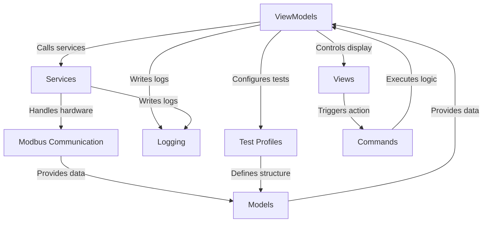
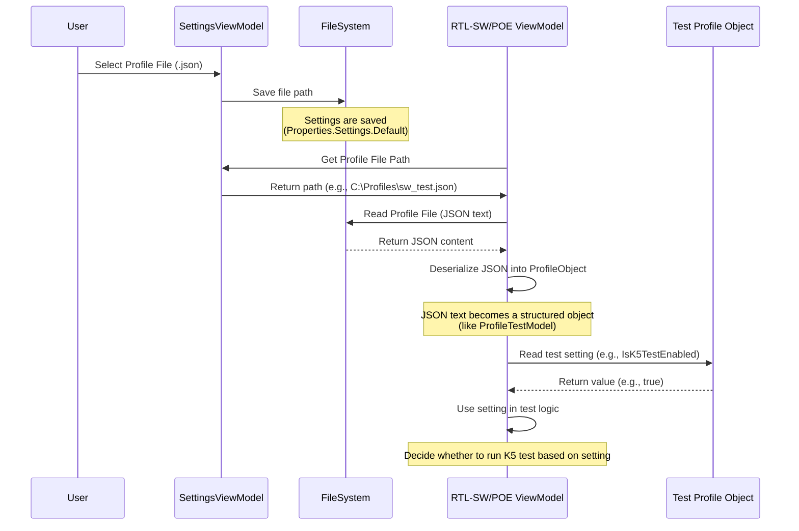
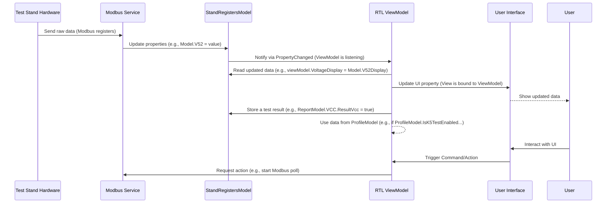
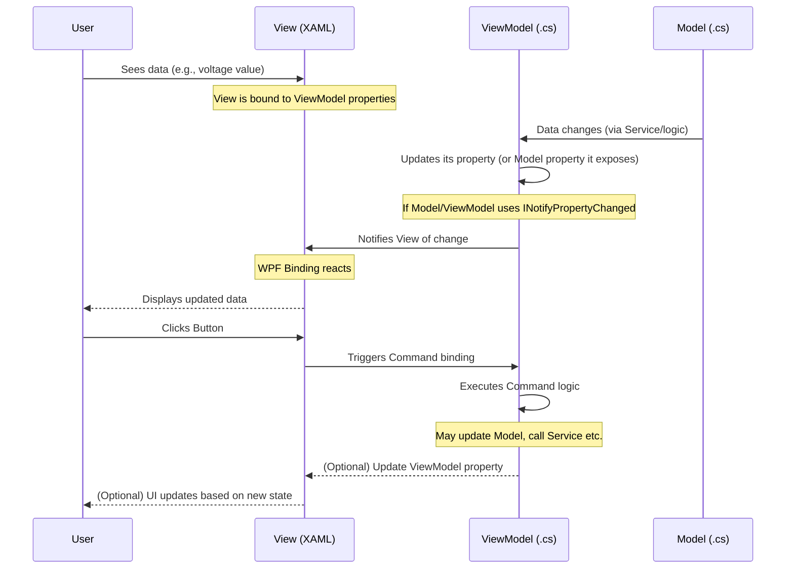

# Tutorial: RTL_v2

This project is a **test application** designed to interface with hardware **test stands** for different electronics boards. It allows users to **configure and run automated tests**, communicate with the hardware using *Modbus*, *log* events, generate *reports*, and *print labels* based on defined *test profiles*.


## Visual Overview



## Chapters

1. [Test Profiles
](01_test_profiles_.md)
2. [Models
](02_models_.md)
3. [Views
](03_views_.md)
4. [ViewModels
](04_viewmodels_.md)
5. [Commands
](05_commands_.md)
6. [Services
](06_services_.md)
7. [Modbus Communication
](07_modbus_communication_.md)
8. [Logging
](08_logging_.md)

---

<sub><sup>Generated by [AI Codebase Knowledge Builder](https://github.com/The-Pocket/Tutorial-Codebase-Knowledge).</sup></sub>


# Chapter 1: Test Profiles

Welcome to the tutorial for the `RTL_v2` project! In this first chapter, we're going to learn about a fundamental concept called **Test Profiles**. Think of Test Profiles as the "instruction manuals" for our testing application.

## What's the Problem?

Our application needs to test different types of circuit boards, specifically `RTL-SW` and `RTL-POE`. These boards are different! They have different components, require different power levels, need different checks (like testing PoE ports or specific voltage regulators), and might have different flashing procedures.

How can one single application know exactly how to test each type of board without having separate versions for each?

This is where **Test Profiles** come in.

## What are Test Profiles?

A Test Profile is simply a **configuration file**. In our project, these files are written in a format called **JSON**.

Imagine you have a recipe book. Each recipe tells you what ingredients you need (parameters), how much of each ingredient (thresholds), and which steps to follow (enabled tests). A Test Profile is like a recipe for testing a specific type of board.

When you start testing a specific board (like an `RTL-SW`), the application doesn't have the test steps hardcoded inside it. Instead, it **loads** the Test Profile file that is meant for the `RTL-SW` board. This profile file contains all the instructions the application needs:

*   Which tests should be run? (Enable/Disable flags)
*   What are the expected voltage ranges? (Thresholds)
*   How long should the application wait between certain steps? (Delays)
*   Specific file paths needed for flashing, etc.

By using different Test Profile files, the *same* application can correctly test completely different types of boards!

## Test Profiles in Action: The User's View

As a user of the `RTL_v2` application, you will typically select the Test Profile file you want to use in the application's settings.

Let's look at a simplified view of the settings in the code.

```csharp
// --- File: ViewModels/SettingsViewModel.cs ---

// ... other properties ...

private string _rtlSwProfilePath;
public string RtlSwProfilePath
{
    get => _rtlSwProfilePath;
    set
    {
        if (SetAndNotify(ref _rtlSwProfilePath, value))
        {
            // When the path changes, save it for next time
            Properties.Settings.Default.RtlSwProfilePath = value;
            Properties.Settings.Default.Save();
        }
    }
}

private string _rtlPoeProfilePath;
public string RtlPoeProfilePath
{
    get => _rtlPoeProfilePath;
    set
    {
        if (SetAndNotify(ref _rtlPoeProfilePath, value))
        {
            // Save the path for the RTL-POE profile
            Properties.Settings.Default.RtlPoeProfilePath = value;
            Properties.Settings.Default.Save();
        }
    }
}

// ... other properties and commands ...

// Command to let the user select the RTL-SW profile file
public RelayCommand SelectRtlSwProfileCommand { get; }

// Command to let the user select the RTL-POE profile file
public RelayCommand SelectRtlPoeProfileCommand { get; }

public SettingsViewModel()
{
    // Load paths from saved settings when the application starts
    RtlSwProfilePath = Properties.Settings.Default.RtlSwProfilePath ?? string.Empty;
    RtlPoeProfilePath = Properties.Settings.Default.RtlPoeProfilePath ?? string.Empty;

    // Setup commands to open file dialogs
    SelectRtlSwProfileCommand = new RelayCommand(SelectRtlSwProfile);
    SelectRtlPoeProfileCommand = new RelayCommand(SelectRtlPoeProfile);
}

private void SelectRtlSwProfile()
{
    var dialog = new OpenFileDialog // This opens a file selection window
    {
        Filter = "JSON files (*.json)|*.json", // Only show .json files
        Title = "Select RTL-SW Profile"
    };
    if (dialog.ShowDialog() == true)
    {
        RtlSwProfilePath = dialog.FileName; // Update the property, which saves the setting
    }
}

private void SelectRtlPoeProfile()
{
     var dialog = new OpenFileDialog
     {
         Filter = "JSON files (*.json)|*.json",
         Title = "Select RTL-POE Profile"
     };
     if (dialog.ShowDialog() == true)
     {
         RtlPoeProfilePath = dialog.FileName; // Update the property, which saves the setting
     }
}
// ... rest of the class ...
```

This code snippet shows that the `SettingsViewModel` (which manages the application's settings screen) has properties (`RtlSwProfilePath`, `RtlPoeProfilePath`) to store the file paths of the selected profiles. When the user clicks a button (handled by `SelectRtlSwProfileCommand` or `SelectRtlPoeProfileCommand`), a file dialog pops up, allowing them to pick a `.json` file. The chosen path is then saved in the application's settings so it remembers it for next time.

This is how the *user* tells the application which "recipe book" to use for each board type.

## How Test Profiles Work Inside

When the application is ready to start testing a board (for example, when connecting to the test stand, as seen in the `RtlSwViewModel` and `RtlPoeViewModel` code), it needs to read the chosen profile file.

Here's a simplified sequence of what happens:



The ViewModel responsible for testing (`RtlSwViewModel` or `RtlPoeViewModel`) reads the saved file path. It then uses code to open the specified JSON file and read its contents.

Let's look at the code that does this loading in `RtlSwViewModel`:

```csharp
// --- File: ViewModels/RtlSwViewModel.cs ---

// ... other properties and methods ...

private ProfileTestModel _testConfig; // This will hold the loaded profile data

public ProfileTestModel TestConfig
{
    get => _testConfig;
    set => SetAndNotify(ref _testConfig, value); // Notify the UI when it changes
}

private bool _isTestProfileLoaded;
public bool IsTestProfileLoaded
{
    get => _isTestProfileLoaded;
    set => SetAndNotify(ref _isTestProfileLoaded, value);
}

private async Task<bool> TryLoadTestProfileAsync()
{
    try
    {
        // Get the file path from saved settings
        string testProfilePath = Properties.Settings.Default.RtlSwProfilePath;

        if (File.Exists(testProfilePath)) // Check if the file actually exists
        {
            // Read the entire file content as a string
            string json = await File.ReadAllTextAsync(testProfilePath);

            // Use Newtonsoft.Json to convert the JSON string into our C# object
            TestConfig = JsonConvert.DeserializeObject<ProfileTestModel>(json) ?? new ProfileTestModel();

            OnPropertyChanged(nameof(TestConfig)); // Notify the UI that the profile is ready
            IsTestProfileLoaded = true;
            _logger.LogToUser($"Test profile loaded successfully: {testProfilePath}", LogLevel.Success);
            return true;
        }
        else
        {
            // Handle case where the file is not found
            TestConfig = new ProfileTestModel(); // Create a default empty profile
            OnPropertyChanged(nameof(TestConfig));
            IsTestProfileLoaded = false;
            _logger.LogToUser($"Test profile file {testProfilePath} not found.", LogLevel.Warning);
            return false;
        }
    }
    catch (JsonException ex)
    {
        // Handle errors if the JSON is not valid
        TestConfig = new ProfileTestModel();
        OnPropertyChanged(nameof(TestConfig));
        IsTestProfileLoaded = false;
        _logger.LogToUser($"JSON parsing error: {ex.Message}", LogLevel.Error);
        return false;
    }
    catch (Exception ex)
    {
        // Handle any other errors during loading
        TestConfig = new ProfileTestModel();
        OnPropertyChanged(nameof(TestConfig));
        IsTestProfileLoaded = false;
        _logger.LogToUser($"Error loading test profile: {ex.Message}", LogLevel.Error);
        return false;
    }
}

// ... rest of the class ...
```

This method is called when the application connects to the stand. It retrieves the path from settings, reads the JSON file, and crucially, uses `JsonConvert.DeserializeObject` (from the Newtonsoft.Json library) to transform the text data into a `ProfileTestModel` object. This object (`TestConfig`) now holds all the structured settings defined in the profile file.

The `RtlPoeViewModel` has a very similar method (`TryLoadTestProfileAsync`) using `PoeTestProfileModel` and loading the path from `Properties.Settings.Default.RtlPoeProfilePath`.

## What's Inside the Profile Object?

The `ProfileTestModel` and `PoeTestProfileModel` classes define the structure of the data that comes from the JSON file. Each property in these classes corresponds to a setting in the JSON.

Let's look at a simplified version of `ProfileTestModel`:

```csharp
// --- File: Models/ProfileTestModel.cs ---
using Newtonsoft.Json;
// ... other usings ...

public class ProfileTestModel : INotifyPropertyChanged // It notifies UI if settings change
{
    // Properties match the JSON structure
    [JsonProperty("model_name")] // This links the property to the JSON key
    public string ModelName { get; set; }

    [JsonProperty("1.Проверка узла K5")] // JSON key for enabling the K5 test
    public bool IsK5TestEnabled { get; set; }

    [JsonProperty("k5_52V_min")] // Minimum expected voltage for 52V during K5 test
    public ushort K5_52V_Min { get; set; }

    [JsonProperty("k5_52V_max")] // Maximum expected voltage for 52V during K5 test
    public ushort K5_52V_Max { get; set; }

    // ... lots of other properties for voltages, delays, other test enables ...

    [JsonProperty("7. печать этикетки")] // JSON key for enabling label printing
    public bool IsLabelPrintingEnabled { get; set; }

    // ... PropertyChanged implementation ...
}
```

The `PoeTestProfileModel` is structured similarly but contains properties relevant to the PoE board tests (like `IsPoeTestRequired`, `V3v3Min`, `LedColour`, etc.).

The `[JsonProperty("...")]` part tells the `JsonConvert` how to match the keys in the JSON file (like `"k5_52V_min"`) to the properties in the C# class (`K5_52V_Min`).

## Using the Profile Settings in Tests

Once the `TestConfig` object (or `PoeTestProfileModel` in the other ViewModel) is loaded, the application's test logic uses the values from this object to control the test flow and check results.

For example, in `RtlSwViewModel.cs`, the `RunK5TestsAsync` method checks `TestConfig.IsK5TestEnabled` before running the K5 tests:

```csharp
// --- File: ViewModels/RtlSwViewModel.cs ---

// ... other code ...

private async Task<bool> RunK5TestsAsync(CancellationToken cancellationToken)
{
    // Check the setting from the loaded profile
    if (!TestConfig.IsK5TestEnabled)
    {
        _logger.LogToUser("K-5 test is disabled in the profile.", LogLevel.Warning);
        return true; // Skip the test but report it as "passed" in terms of workflow
    }

    _logger.LogToUser("Running K-5 node test...", LogLevel.Info);

    // ... test logic using TestConfig.K5TestDelay ...

    // Example of using a threshold from the profile during a K5 sub-test
    // (Simplified for clarity - the actual check is done by the stand firmware based on values sent to registers)
    // In the code, we send the min/max values *to* the stand before the test starts
    // as seen in PrepareStandForTestingAsync:
    // await WriteToRegisterWithRetryAsync(2333, TestConfig.K5_52V_Min);
    // await WriteToRegisterWithRetryAsync(2334, TestConfig.K5_52V_Max);

    // The stand then performs the check and reports pass/fail status back
    // which is then read and logged, as shown in RunSubTestK5Async:
    // _logger.LogToUser($"Measured results: 55V={report.V55Report}; 52V={report.V52Report}; ...", success ? LogLevel.Success : LogLevel.Error);

    return allSuccess;
}

// ... rest of the class ...
```

This pattern is repeated throughout the testing logic in both `RtlSwViewModel` and `RtlPoeViewModel`. Every time the application needs to know *whether* to run a test step, *what value* is acceptable, or *how long* to wait, it consults the loaded `TestConfig` (or `PoeTestProfileModel`).

## Summary

Test Profiles (JSON files) provide the `RTL_v2` application with flexible instructions for testing different board types (RTL-SW and RTL-POE). They define parameters, thresholds, and enabled tests. The application loads the appropriate profile based on user selection, converts the JSON data into a structured C# object (`ProfileTestModel` or `PoeTestProfileModel`), and uses this object to control the test execution. This allows the application to be highly adaptable without needing code changes for each new board variation or test requirement.

In the next chapter, we will dive deeper into the **Models** within the application, which are used not only for Test Profiles but also for representing other important data like the status of the test stand and the results of the tests.

[Chapter 2: Models](02_models_.md)

---

<sub><sup>Generated by [AI Codebase Knowledge Builder](https://github.com/The-Pocket/Tutorial-Codebase-Knowledge).</sup></sub> <sub><sup>**References**: [[1]](https://github.com/kotyasmol/RTL_v2/blob/ef4d2ddcfd3424dc84a92ad06106a11a8bed5eab/Models/PoeTestProfileModel.cs), [[2]](https://github.com/kotyasmol/RTL_v2/blob/ef4d2ddcfd3424dc84a92ad06106a11a8bed5eab/Models/ProfileTestModel.cs), [[3]](https://github.com/kotyasmol/RTL_v2/blob/ef4d2ddcfd3424dc84a92ad06106a11a8bed5eab/ViewModels/RtlPoeViewModel.cs), [[4]](https://github.com/kotyasmol/RTL_v2/blob/ef4d2ddcfd3424dc84a92ad06106a11a8bed5eab/ViewModels/RtlSwViewModel.cs), [[5]](https://github.com/kotyasmol/RTL_v2/blob/ef4d2ddcfd3424dc84a92ad06106a11a8bed5eab/ViewModels/SettingsViewModel.cs)</sup></sub>


# Chapter 2: Models

Welcome back to the `RTL_v2` tutorial! In [Chapter 1: Test Profiles](01_test_profiles_.md), we learned how configuration files (Test Profiles) act like instruction manuals for our testing application, defining *what* tests to run and *what values* to expect. These profiles are loaded into special C# classes like `ProfileTestModel`.

But what exactly *are* these `ProfileTestModel` classes? And what about the data that represents the live status of the test stand, or the data that stores the final test results? This brings us to the concept of **Models**.

## What are Models?

In software development, especially in applications with a user interface like `RTL_v2`, we often follow a pattern called MVVM (Model-View-ViewModel). We'll learn about [Views](03_views_.md) and [ViewModels](04_viewmodels_.md) later, but for now, let's focus on **Models**.

Think of Models as the **data containers** of your application. They are simple classes or structures whose main job is to hold information. They represent the "things" or "nouns" in your application's world.

In `RTL_v2`, Models hold things like:

*   The current readings and status from the test stand hardware.
*   The results of the tests performed.
*   The configuration settings loaded from Test Profile files (as seen in Chapter 1).
*   Any other pieces of data the application needs to keep track of.

Models are generally **passive**. This means they don't usually contain complex logic that *does* things (like talking to hardware, performing calculations, or interacting with the user interface). Their primary role is just to **store data** and, sometimes, provide simple ways to access or format that data (like converting raw sensor values into a more human-readable format).

## Why Do We Need Models?

Imagine trying to build the application without these data containers. You'd have raw numbers and text floating around everywhere in the code, making it messy, hard to understand, and difficult to manage.

Models give structure to our data. By grouping related data into a class (like `StandRegistersModel` for all the test stand readings), we make the code cleaner and easier to work with. It's like organizing your ingredients in labeled containers in the kitchen instead of leaving them in piles on the counter.

The application needs a central place to hold the current status of the test stand, so different parts of the application can access it. It needs a defined structure to record test results consistently. It needs classes to represent the settings loaded from the profile. Models provide this structure and central storage.

## Examples of Models in RTL_v2

Let's look at some key Model classes in the `RTL_v2` project.

### 1. Representing Test Stand Status (`StandRegistersModel`, `PoeRegistersModel`)

The test stand hardware communicates with the application using Modbus ([Chapter 7: Modbus Communication](07_modbus_communication_.md)). It provides various readings like voltages, switch states, sensor values, and other status information, all as numbers (specifically, `ushort` values representing Modbus registers).

The `StandRegistersModel` (for the standard RTL-SW board) and `PoeRegistersModel` (for the RTL-POE board) are designed to hold these raw register values.

Here's a simplified look at `StandRegistersModel.cs`:

```csharp
// --- File: Models/StandRegistersModel.cs (Simplified) ---
using System.ComponentModel; // Needed for INotifyPropertyChanged
using System.Runtime.CompilerServices; // Needed for CallerMemberName

namespace RTL.Models
{
    public class StandRegistersModel : INotifyPropertyChanged // This allows the UI to react to changes
    {
        // Boilerplate code to notify UI when a property changes (more on this later)
        public event PropertyChangedEventHandler PropertyChanged;
        protected virtual void OnPropertyChanged([CallerMemberName] string propertyName = null)
        {
            PropertyChanged?.Invoke(this, new PropertyChangedEventArgs(propertyName));
        }
        private bool SetAndNotify<T>(ref T field, T value, [CallerMemberName] string propertyName = null)
        {
            if (EqualityComparer<T>.Default.Equals(field, value)) return false;
            field = value;
            OnPropertyChanged(propertyName);
            return true;
        }

        // Properties to hold data from the test stand registers
        private ushort _standSerialNumber;
        public ushort StandSerialNumber // Example: Holds the stand's serial number
        {
            get => _standSerialNumber;
            set => SetAndNotify(ref _standSerialNumber, value); // Update value and notify UI
        }

        private ushort _v52;
        public ushort V52 // Example: Holds the raw reading for 52V line
        {
            get => _v52;
            set
            {
                if (SetAndNotify(ref _v52, value))
                {
                    // Also notify that the 'Display' version might have changed
                    OnPropertyChanged(nameof(V52Display));
                }
            }
        }
        // A calculated property for displaying V52, maybe scaling or filtering raw data
        // (Still simple data access/formatting, not complex logic)
        public ushort V52Display => (_v52 > 56000 || _v52 < 1000) ? (ushort)0 : _v52;

        // ... many more properties for other registers like V55, Sensor1, RelayIn, etc. ...

        private ushort _rs485RxOk;
        public ushort RS485RxOK // Example: Status of RS485 communication
        {
            get => _rs485RxOk;
            set => SetAndNotify(ref _rs485RxOk, value);
        }
    }
}
```

Each property in `StandRegistersModel` corresponds directly to a value read from or written to the test stand's hardware registers via Modbus.

Notice the `INotifyPropertyChanged` stuff and the `SetAndNotify` method. While Models are generally passive, they often implement this interface. This is a standard way in .NET for an object to signal to listeners (like the user interface via [ViewModels](04_viewmodels_.md)) that one of its properties has changed. This is crucial for displaying live data; when the Modbus [Service](06_services_.md) updates `StandRegistersModel.V52`, the UI that is showing the V52 value automatically knows to update its display.

The `PoeRegistersModel` is very similar but contains properties specific to the PoE test stand's registers (like individual PoE port statuses, UART voltages, etc.).

### 2. Storing Test Results (`ReportModel`)

After a test is run, the application needs to record the results (Pass/Fail status, measured values for reporting). The `ReportModel` and its helper classes like `StageK5TestReport` are used for this:

```csharp
// --- File: Models/ReportModel.cs (Simplified) ---
// ... usings ...

namespace RTL.Models
{
    public class ReportModel
    {
        // Information about the test stand and the board under test
        public static int StandType { get; set; }
        public static int StandSerialNumber { get; set; }
        // ... board specific info ...

        // Grouped results for different test stages
        public static StageK5TestReport Stage1K5 { get; set; } = new StageK5TestReport();
        // ... Stage2K5, Stage3K5, Stage4K5, Stage5K5 ...

        public static VCCTestReport VCC { get; set; } = new VCCTestReport();

        public static FlashTestReport FlashReport { get; set; } = new FlashTestReport();

        // ... other test reports ...
    }

    // Helper class to group K5 stage results
    public class StageK5TestReport
    {
        public bool ResultK5 { get; set; } // Overall pass/fail for this stage
        public int V52Report { get; set; }  // Measured V52 value during this stage
        public int V55Report { get; set; }  // Measured V55 value during this stage
        // ... other voltage measurements for this stage ...
    }

    // Helper class to group VCC test results
    public class VCCTestReport
    {
        public bool ResultVcc { get; set; } // Overall pass/fail for VCC tests
        public int V33Report { get; set; }   // Measured 3.3V value
        public int V15Report { get; set; }   // Measured 1.5V value
        // ... other VCC related measurements ...
    }

    // Helper class for Flash results
    public class FlashTestReport
    {
        public bool FlashResult { get; set; } // Pass/Fail/Not Run
        public string FlashErrorMessage { get; set; } = string.Empty; // Details if failed
    }
}
```

`ReportModel` itself doesn't hold the individual measurements directly. Instead, it contains instances of other, smaller Model classes (`StageK5TestReport`, `VCCTestReport`, etc.) that group the results logically by test stage. This makes the data structure clean and organized.

Unlike `StandRegistersModel`, the properties in `ReportModel` and its helper classes don't implement `INotifyPropertyChanged`. This is because the test results are typically calculated and set *once* at the end of a test stage or the entire test run, rather than constantly changing live data.

### 3. Configuration Settings (`ProfileTestModel`, `PoeTestProfileModel`)

As we saw in [Chapter 1: Test Profiles](01_test_profiles_.md), the settings loaded from the JSON profile files are also stored in Model classes: `ProfileTestModel` and `PoeTestProfileModel`.

```csharp
// --- File: Models/ProfileTestModel.cs (Simplified) ---
// ... usings including Newtonsoft.Json ...

namespace RTL.Models
{
    public class ProfileTestModel : INotifyPropertyChanged // Can also notify if settings are changed *after* loading
    {
        // Properties matching JSON keys
        [JsonProperty("model_name")]
        public string ModelName { get; set; }

        [JsonProperty("1.Проверка узла K5")] // Setting for enabling/disabling K5 test
        public bool IsK5TestEnabled { get; set; }

        [JsonProperty("k5_52V_min")] // Minimum voltage threshold for K5 test
        public ushort K5_52V_Min { get; set; }

        // ... many other properties for thresholds, delays, enable flags ...

        [JsonProperty("7. печать этикетки")] // Setting for label printing
        public bool IsLabelPrintingEnabled { get; set; }

        // Boilerplate for INotifyPropertyChanged...
    }
}
```

These classes contain properties for every setting defined in the profile JSON. Again, they primarily just hold data. The `[JsonProperty(...)]` attributes are hints for the Newtonsoft.Json library, telling it which JSON key maps to which property in the C# class during the loading process we saw in Chapter 1.

### 4. Other Data Models (`FlashProgrammingContext`)

The project has other, less central Model classes used to hold specific sets of data. For example, `FlashProgrammingContext` holds all the necessary information for running the external flash programming tool:

```csharp
// --- File: Models/FlashProgrammingContext.cs (Simplified) ---
// ... usings ...

namespace RTL.Models
{
    public class FlashProgrammingContext
    {
        public string FlashProgramPath { get; set; } // Path to the flashing EXE
        public string ProjectFilePath { get; set; }  // Path to the project file (.mpj)
        public bool IsFirstRun { get; set; }         // Flag to show instruction first time
        public int FlashDelaySeconds { get; set; } = 180; // How long to wait
        public bool AutoMode { get; set; }      // Auto or manual mode
    }
}
```

This is another simple data container, grouping related pieces of information needed for a specific task (flashing).

## How Models Are Used

So, we have these classes holding different types of data. How do other parts of the application interact with them?

Models are typically created, updated, and read by [ViewModels](04_viewmodels_.md) and [Services](06_services_.md).



*   **[Services](06_services_.md)** (like the Modbus communication logic) are responsible for getting data from external sources (the test stand) and putting it *into* the appropriate Models (`StandRegistersModel`, `PoeRegistersModel`).
*   **[ViewModels](04_viewmodels_.md)** are the intermediaries between the [Views](03_views_.md) (what the user sees) and the Models. They read data *from* the Models to display it in the [View](03_views_.md). They might also write data *into* Models (like saving test results into `ReportModel`). [ViewModels](04_viewmodels_.md) also read configuration data from Models like `ProfileTestModel` to decide how to proceed with testing.

Let's see a tiny code example showing a [Service](06_services_.md) updating a Model and a [ViewModel](04_viewmodels_.md) using that Model.

First, the [Service](06_services_.md) receives data from the hardware and updates the Model:

```csharp
// --- Hypothetical Service Code (Simplified) ---
public class ModbusService // (Covered in Chapter 7)
{
    private StandRegistersModel _standRegisters; // Holds a reference to the Model

    public ModbusService(StandRegistersModel standRegisters)
    {
        _standRegisters = standRegisters; // Get the instance of the Model
    }

    // Method called when new data is received from the stand
    public void ProcessReceivedData(ushort[] registerValues)
    {
        // Update the Model properties with the new values
        // The specific index maps to the register address
        _standRegisters.StandSerialNumber = registerValues[0]; // Example mapping
        _standRegisters.V52 = registerValues[5]; // Example mapping
        // ... update all other properties ...
    }
}
```
*Explanation:* The `ModbusService` has a direct link to the `StandRegistersModel` instance. When it reads data from the hardware, it finds the correct place in the `StandRegistersModel` (e.g., the `V52` property) and updates its value. Because `StandRegistersModel` uses `SetAndNotify`, this change automatically alerts anything listening (like the [ViewModel](04_viewmodels_.md)).

Now, how the [ViewModel](04_viewmodels_.md) uses this Model:

```csharp
// --- Hypothetical ViewModel Code (Simplified) ---
public class RtlSwViewModel // (Covered in Chapter 4)
{
    // References to the Models it needs
    public StandRegistersModel StandRegisters { get; } // ViewModel holds the Model instance
    public ProfileTestModel TestConfig { get; }         // Holds the loaded profile config

    public ReportModel CurrentReport { get; }          // Holds the current test results

    // Properties the View will bind to, often getting data from Models
    public string StandStatusText => $"Serial: {StandRegisters.StandSerialNumber}";
    public string CurrentV52Reading => $"{StandRegisters.V52Display / 1000.0:F2} V"; // Reads from the Model

    public string OverallTestResult { get; set; } // Set by ViewModel based on ReportModel

    public RtlSwViewModel(StandRegistersModel standRegs, ProfileTestModel profileConfig, ReportModel report)
    {
        // ViewModel gets instances of the Models, often passed in
        StandRegisters = standRegs;
        TestConfig = profileConfig;
        CurrentReport = report;

        // The ViewModel might listen to the Model for updates
        // StandRegisters.PropertyChanged += (sender, args) => OnPropertyChanged(args.PropertyName); // Simplified connection
    }

    // Method to run a test step
    public async Task RunK5Test()
    {
        // Check the configuration setting from the Profile Model
        if (!TestConfig.IsK5TestEnabled)
        {
            // Test is disabled according to the profile, skip it.
            return;
        }

        // ... Perform test steps (may involve telling the Service to interact with hardware) ...

        // After test step, potentially update the Report Model with results
        CurrentReport.Stage1K5.ResultK5 = true; // Assume test passed
        CurrentReport.Stage1K5.V52Report = StandRegisters.V52; // Record the measured value
    }

    // ... other ViewModel logic ...
}
```
*Explanation:* The `RtlSwViewModel` keeps references to the `StandRegistersModel`, `ProfileTestModel`, and `ReportModel`.
*   It uses data from `StandRegistersModel` (`StandRegisters.StandSerialNumber`, `StandRegisters.V52Display`) to create properties (`StandStatusText`, `CurrentV52Reading`) that the user interface ([View](03_views_.md)) can display.
*   It reads settings from `ProfileTestModel` (`TestConfig.IsK5TestEnabled`) to decide whether to run a specific test.
*   After a test step, it writes the results into `ReportModel` (`CurrentReport.Stage1K5.ResultK5`, `CurrentReport.Stage1K5.V52Report`).

This shows how Models act as the central source of data that [Services](06_services_.md) update and [ViewModels](04_viewmodels_.md) read from and write to.

## Models are Passive

It's worth repeating: Models are generally passive data holders. They don't contain the *logic* for *how* to run a test, *how* to communicate via Modbus, or *how* to display data on the screen. That logic belongs in [ViewModels](04_viewmodels_.md) and [Services](06_services_.md).

Models are like simple data structures, defining the shape and type of the information. Their simplicity helps keep the application organized and makes it easier to change the business logic ([ViewModels](04_viewmodels_.md)) or how data is obtained ([Services](06_services_.md)) without affecting the core data representation itself.

## Conclusion

Models are fundamental building blocks in `RTL_v2`. They are simple classes primarily used to hold the application's data – whether it's live readings from the test stand (`StandRegistersModel`, `PoeRegistersModel`), configuration settings from profiles (`ProfileTestModel`, `PoeTestProfileModel`), or the results of tests (`ReportModel`). They are updated by [Services](06_services_.md) and used by [ViewModels](04_viewmodels_.md) to manage the application's state and interact with the user interface.

Now that we understand how data is structured and held in Models, let's look at the next piece of the puzzle: the user interface itself, the **Views**.

[Chapter 3: Views](03_views_.md)

---

<sub><sup>Generated by [AI Codebase Knowledge Builder](https://github.com/The-Pocket/Tutorial-Codebase-Knowledge).</sup></sub> <sub><sup>**References**: [[1]](https://github.com/kotyasmol/RTL_v2/blob/ef4d2ddcfd3424dc84a92ad06106a11a8bed5eab/Models/FlashProgrammingContext.cs), [[2]](https://github.com/kotyasmol/RTL_v2/blob/ef4d2ddcfd3424dc84a92ad06106a11a8bed5eab/Models/PoeRegistersModel.cs), [[3]](https://github.com/kotyasmol/RTL_v2/blob/ef4d2ddcfd3424dc84a92ad06106a11a8bed5eab/Models/PoeTestProfileModel.cs), [[4]](https://github.com/kotyasmol/RTL_v2/blob/ef4d2ddcfd3424dc84a92ad06106a11a8bed5eab/Models/ProfileTestModel.cs), [[5]](https://github.com/kotyasmol/RTL_v2/blob/ef4d2ddcfd3424dc84a92ad06106a11a8bed5eab/Models/ReportModel.cs), [[6]](https://github.com/kotyasmol/RTL_v2/blob/ef4d2ddcfd3424dc84a92ad06106a11a8bed5eab/Models/StandRegistersModel.cs)</sup></sub>


# Chapter 3: Views

Welcome back! In the previous chapter, [Chapter 2: Models](02_models_.md), we learned that **Models** are the simple data containers in our application, holding information like test stand readings or profile settings. But raw data isn't very useful to a user unless they can see it and interact with it.

This is where **Views** come in.

## What's the Problem?

We have all this important data stored in our [Models](02_models_.md). We know the current voltage readings from the test stand, the status of different components, and the configuration settings loaded from the Test Profile. How do we show this information to the person using the application? How do we let them click a button to start a test, select a file path, or change a setting?

We need a user interface!

## What are Views?

**Views** are the part of the application that the user actually sees and interacts with. They are the visual elements displayed on the screen – things like windows, buttons, text boxes, labels, progress bars, and images.

Think of a View as the **"face" of the application**. It's what presents the information *to* the user and captures their input (like button clicks or text typed).

In our `RTL_v2` project, Views are primarily defined using **XAML** (eXtensible Application Markup Language). XAML is a special language for creating user interfaces in Windows Presentation Foundation (WPF), which is the technology our application uses for its UI.

## Views in `RTL_v2`: Looking at the XAML

You'll find the Views in the `Views` folder of the project. They are `.xaml` files, often paired with a very small `.xaml.cs` code-behind file.

Let's look at a small piece from `Views/SettingsView.xaml`. This file defines the visual layout of the application's settings screen.

```xml
<!-- --- File: Views/SettingsView.xaml (Snippet) --- -->
<UserControl x:Class="RTL.Views.SettingsView"
             xmlns="http://schemas.microsoft.com/winfx/2006/xaml/presentation"
             xmlns:x="http://schemas.microsoft.com/winfx/2006/xaml">
    
    <!-- This StackPanel arranges elements vertically -->
    <StackPanel Margin="10">
        
        <!-- A section for General Settings -->
        <Expander Header="Общие настройки" IsExpanded="True">
            <!-- StackPanel inside the expander -->
            <StackPanel Margin="10">
                <!-- A simple label -->
                <TextBlock Text="Папка для логов:" FontWeight="Bold"/>
                <!-- A horizontal arrangement -->
                <StackPanel Orientation="Horizontal">
                    <!-- A text box to display the log folder path -->
                    <TextBox Text="{Binding LogFolderPath, Mode=TwoWay}" Width="200" IsReadOnly="True"/>
                    <!-- A button to select the folder -->
                    <Button Content="Выбрать..." Command="{Binding SelectLogFolderCommand}" Margin="5,0,0,0"/>
                </StackPanel>
            </StackPanel>
        </Expander>

        <!-- Another section for RTL-SW settings -->
        <Expander Header="Настройки RTL-SW" IsExpanded="False">
            <StackPanel Margin="10">
                 <TextBlock Text="Профиль RTL-SW:" FontWeight="Bold"/>
                 <StackPanel Orientation="Horizontal">
                    <!-- Text box for RTL-SW profile path -->
                    <TextBox Text="{Binding RtlSwProfilePath, Mode=TwoWay}" Width="200" IsReadOnly="True"/>
                    <!-- Button to select RTL-SW profile -->
                    <Button Content="Выбрать..." Command="{Binding SelectRtlSwProfileCommand}" Margin="5,0,0,0"/>
                 </StackPanel>
                 <!-- ... other RTL-SW settings elements ... -->
            </StackPanel>
        </Expander>
        <!-- ... rest of the SettingsView UI ... -->
    </StackPanel>
</UserControl>
```
*Explanation:* This XAML code describes what the settings screen looks like. It uses elements like `StackPanel` to arrange things, `TextBlock` for labels, `TextBox` for showing or entering text, `Button` for actions, and `Expander` to create collapsable sections.

Notice that the XAML defines *visual elements* and their *layout*, but it doesn't contain code that says *how* to select a folder or *where* the `LogFolderPath` value comes from. That's the job of the [ViewModel](04_viewmodels_.md).

## Connecting Views to ViewModels: Data Binding and Commands

The core idea in the MVVM pattern (Model-View-ViewModel) that `RTL_v2` uses is that **Views should be as "dumb" as possible**. They shouldn't contain complex logic. Instead, they get the data they need to display *from* a [ViewModel](04_viewmodels_.md) and tell the [ViewModel](04_viewmodels_.md) *when* the user does something.

This connection between the View and its associated [ViewModel](04_viewmodels_.md) is achieved primarily through two mechanisms:

1.  **Data Binding:** Linking a UI element's property (like the `Text` of a `TextBlock`, the `Value` of a `ProgressBar`, or the `IsChecked` of a `ToggleButton`) directly to a property in the [ViewModel](04_viewmodels_.md). When the [ViewModel](04_viewmodels_.md) property changes, the View automatically updates.
2.  **Commands:** Linking interactive UI elements (like `Button`s or `ToggleButton`s) to **Commands** ([Chapter 5: Commands](05_commands_.md)) defined in the [ViewModel](04_viewmodels_.md). When the user interacts with the element (e.g., clicks a button), the associated command in the [ViewModel](04_viewmodels_.md) is executed.

Let's look at examples of Data Binding and Commands from the `RtlSwView.xaml`:

```xml
<!-- --- File: Views/RtlSwView.xaml (Snippet) --- -->
<!-- ... other XAML ... -->
    <Grid Grid.Column="1" Margin="10">
        <!-- ... other UI elements ... -->
            
        <!-- Border with control buttons -->
        <Border Grid.Column="0" Grid.Row="0" BorderThickness="2" CornerRadius="10" Padding="10">
            <StackPanel Orientation="Vertical">
                <!-- Connect Button -->
                <Button Width="150" Height="30" 
                        Command="{Binding ConnectCommand}" <!-- <<< Command Binding -->
                        ToolTip="Установка / прерывание связи со стендом"
                        Background="{Binding IsStandConnected, Converter={StaticResource BoolToColorConverter}}"> <!-- <<< Data Binding -->
                    <TextBlock Text="{Binding IsStandConnected, Converter={StaticResource BoolToTextConverter}}"/> <!-- <<< Data Binding -->
                </Button>

                <!-- Profile Load Button -->
                <StackPanel Orientation="Horizontal" Margin="0,5">
                    <Button Width="16" Height="16" 
                            Command="{Binding LoadTestProfileCommand}"> <!-- <<< Command Binding -->
                        <!-- Uses a custom template with a background bound to IsTestProfileLoaded -->
                        <Button.Template>
                            <ControlTemplate TargetType="{x:Type Button}">
                                <Border Background="{Binding IsTestProfileLoaded, Converter={StaticResource BoolToColorConverter}}"> <!-- <<< Data Binding inside Template -->
                                    <ContentPresenter HorizontalAlignment="Center" VerticalAlignment="Center"/>
                                </Border>
                            </ControlTemplate>
                        </Button.Template>
                    </Button>
                    <TextBlock Text="Профиль" VerticalAlignment="Center" Margin="10,0,0,0"/>
                </StackPanel>
                <!-- ... other status buttons using similar binding patterns ... -->
            </StackPanel>
        </Border>

        <!-- Power Control Expanders (Simplified) -->
        <Expander Grid.Row="0" Header="ПИТАНИЕ">
             <StackPanel Margin="5">
                 <!-- ToggleSwitch for V52 -->
                 <StackPanel Orientation="Horizontal" VerticalAlignment="Center">
                     <ToggleButton 
                         IsChecked="{Binding IsV52Enabled, Mode=TwoWay}" <!-- <<< Data Binding (Two-Way) -->
                         Style="{StaticResource SwitchButtonStyle}"/>
                     <TextBlock Text="V52"/>
                 </StackPanel>
                 <!-- ... V55 and Reset toggle buttons ... -->
             </StackPanel>
        </Expander>

        <!-- Voltage Readings Display (Simplified) -->
        <WrapPanel Grid.Column="0" Grid.Row="1" Grid.ColumnSpan="2">
             <!-- 52V Display -->
             <Border Width="150" Height="60" CornerRadius="10" Background="#1562FE" Margin="5">
                 <Grid>
                     <!-- ... layout elements ... -->
                     <StackPanel Grid.Column="1">
                         <!-- Displaying live 52V reading from the Model via ViewModel -->
                         <TextBlock Text="{Binding StandRegisters.V52Display}"  /><!-- <<< Data Binding -->
                         <!-- Displaying thresholds from the Profile Model via ViewModel -->
                         <StackPanel Orientation="Horizontal">
                             <TextBlock Text="{Binding TestConfig.K5_52V_Min}" /><!-- <<< Data Binding -->
                             <TextBlock Text=" - "/>
                             <TextBlock Text="{Binding TestConfig.K5_52V_Max}" /><!-- <<< Data Binding -->
                         </StackPanel>
                     </StackPanel>
                 </Grid>
             </Border>
             <!-- ... other voltage displays ... -->
        </WrapPanel>
        <!-- ... rest of the RtlSwView UI ... -->
    </Grid>
<!-- ... other XAML ... -->
```

*Explanation:*
*   `Command="{Binding ConnectCommand}"`: This line tells the button, "When you are clicked, find the property named `ConnectCommand` on my associated [ViewModel](04_viewmodels_.md) and execute it." The `ConnectCommand` property in the [ViewModel](04_viewmodels_.md) will be an object that knows how to handle the connection logic.
*   `Background="{Binding IsStandConnected, Converter={StaticResource BoolToColorConverter}}"` and `Text="{Binding IsStandConnected, Converter={StaticResource BoolToTextConverter}}"`: These lines tell the UI elements, "Get your `Background` and `Text` values from the `IsStandConnected` property on my associated [ViewModel](04_viewmodels_.md). Use the specified `Converter` to change the `bool` value into a color or text." When the [ViewModel](04_viewmodels_.md) updates the `IsStandConnected` property (which happens when the connection status changes), the button's appearance and text update automatically.
*   `IsChecked="{Binding IsV52Enabled, Mode=TwoWay}"`: This links the state of the toggle switch directly to the `IsV52Enabled` property in the [ViewModel](04_viewmodels_.md). `Mode=TwoWay` means that if the user clicks the toggle (changing its `IsChecked` state), the `IsV52Enabled` property in the [ViewModel](04_viewmodels_.md) is *also* updated. If the [ViewModel](04_viewmodels_.md) changes `IsV52Enabled`, the toggle state updates.
*   `Text="{Binding StandRegisters.V52Display}"`: This shows how the View can display data from a [Model](02_models_.md) (`StandRegisters`) by accessing it through a property in the [ViewModel](04_viewmodels_.md). The [ViewModel](04_viewmodels_.md) exposes the `StandRegisters` [Model](02_models_.md) instance, and the View binds to a property on that [Model](02_models_.md).
*   `Text="{Binding TestConfig.K5_52V_Min}"`: Similarly, this binds to data stored in the `TestConfig` [Model](02_models_.md), which is also exposed by the [ViewModel](04_viewmodels_.md).

The `DataContext` (usually set in the code that creates the View and [ViewModel](04_viewmodels_.md)) is what tells the View *which* [ViewModel](04_viewmodels_.md) instance these `Binding`s should look at.

This is how the View stays focused on just displaying things and handling user clicks, while the [ViewModel](04_viewmodels_.md) handles *what* data to show and *what* to do when something is clicked.

Here's a simplified flow:



## Views and Code-Behind

As mentioned, the goal is minimal code-behind (`.xaml.cs` files). Ideally, the `.xaml.cs` file for a View would contain *only* the `InitializeComponent()` call, which is needed to load the XAML definition.

```csharp
// --- File: Views/SettingsView.xaml.cs ---
using System.Windows.Controls;

namespace RTL.Views
{
    public partial class SettingsView : UserControl
    {
        public SettingsView()
        {
            InitializeComponent(); // Loads the XAML
        }
    }
}
```
*Explanation:* This is the standard, minimal code-behind. Everything else (data display, button actions) is handled via XAML bindings to the [ViewModel](04_viewmodels_.md).

Sometimes, you *do* need a little bit of code-behind. This is usually for things that are purely related to the UI's behavior and are difficult or impossible to do in XAML or the [ViewModel](04_viewmodels_.md). A common case is handling UI element events that aren't easily mapped to a simple command, or needing a reference to a specific UI control *within* the [ViewModel](04_viewmodels_.md) (though this is often considered breaking the MVVM pattern slightly and should be used sparingly).

Look at the `RtlSwView.xaml.cs`:

```csharp
// --- File: Views/RtlSwView.xaml.cs ---
using RTL.ViewModels; // Need this to access the ViewModel type
using System.Windows.Controls; // Need this for ListBox
using System.Windows; // Need this for Loaded event

namespace RTL.Views
{
    public partial class RtlSwView : UserControl
    {
        public RtlSwView()
        {
            InitializeComponent(); // Loads the XAML

            // This code runs when the View has finished loading
            Loaded += (s, e) =>
            {
                // Check if the DataContext (the ViewModel) is of the expected type
                if (DataContext is RtlSwViewModel vm)
                {
                    // Pass a reference to the ListBox UI element to the ViewModel
                    // This allows the ViewModel (or code it calls) to add items to the log display.
                    vm.SetLogListBox(LogListBox);
                }
            };
        }
    }
}
```
*Explanation:* Here, the code-behind adds a handler for the `Loaded` event. When the `RtlSwView` is loaded and displayed, this code runs. It accesses the `DataContext` (which is the `RtlSwViewModel` instance) and calls a method `SetLogListBox` on it, passing a reference to the `LogListBox` control defined in the XAML. This is necessary because adding items to a `ListBox` is a specific UI operation, and the [ViewModel](04_viewmodels_.md) needs to tell the UI layer *which* `ListBox` to add logs to. While passing UI controls to ViewModels is sometimes debated in MVVM circles, in this project, it's used specifically for the logging output ListBox for simplicity.

This demonstrates that code-behind is used *only* when interacting directly with the UI framework (`ListBox` control, `Loaded` event). All the actual logic for *what* to log or *when* to add a log message remains in the [ViewModel](04_viewmodels_.md) or other layers.

## Summary

**Views** are the visual part of the `RTL_v2` application, defining the user interface using XAML. They are responsible for:

*   Displaying data, getting values from the [ViewModel](04_viewmodels_.md) via **Data Binding**.
*   Capturing user interaction (like button clicks) and communicating it to the [ViewModel](04_viewmodels_.md) via **Commands**.

Views should contain minimal code-behind logic, focusing mainly on UI initialization or specific UI interactions that cannot be handled declaratively in XAML. This separation keeps the UI clean and makes the application's logic easier to manage in the [ViewModel](04_viewmodels_.md).

Now that we've explored the "face" of the application, let's move on to the "brain" that controls it – the **ViewModels**.

[Chapter 4: ViewModels](04_viewmodels_.md)

---

<sub><sup>Generated by [AI Codebase Knowledge Builder](https://github.com/The-Pocket/Tutorial-Codebase-Knowledge).</sup></sub> <sub><sup>**References**: [[1]](https://github.com/kotyasmol/RTL_v2/blob/ef4d2ddcfd3424dc84a92ad06106a11a8bed5eab/Views/MainView.xaml), [[2]](https://github.com/kotyasmol/RTL_v2/blob/ef4d2ddcfd3424dc84a92ad06106a11a8bed5eab/Views/MainView.xaml.cs), [[3]](https://github.com/kotyasmol/RTL_v2/blob/ef4d2ddcfd3424dc84a92ad06106a11a8bed5eab/Views/RtlPoeView.xaml), [[4]](https://github.com/kotyasmol/RTL_v2/blob/ef4d2ddcfd3424dc84a92ad06106a11a8bed5eab/Views/RtlPoeView.xaml.cs), [[5]](https://github.com/kotyasmol/RTL_v2/blob/ef4d2ddcfd3424dc84a92ad06106a11a8bed5eab/Views/RtlSwView.xaml), [[6]](https://github.com/kotyasmol/RTL_v2/blob/ef4d2ddcfd3424dc84a92ad06106a11a8bed5eab/Views/RtlSwView.xaml.cs), [[7]](https://github.com/kotyasmol/RTL_v2/blob/ef4d2ddcfd3424dc84a92ad06106a11a8bed5eab/Views/SettingsView.xaml), [[8]](https://github.com/kotyasmol/RTL_v2/blob/ef4d2ddcfd3424dc84a92ad06106a11a8bed5eab/Views/SettingsView.xaml.cs)</sup></sub>


