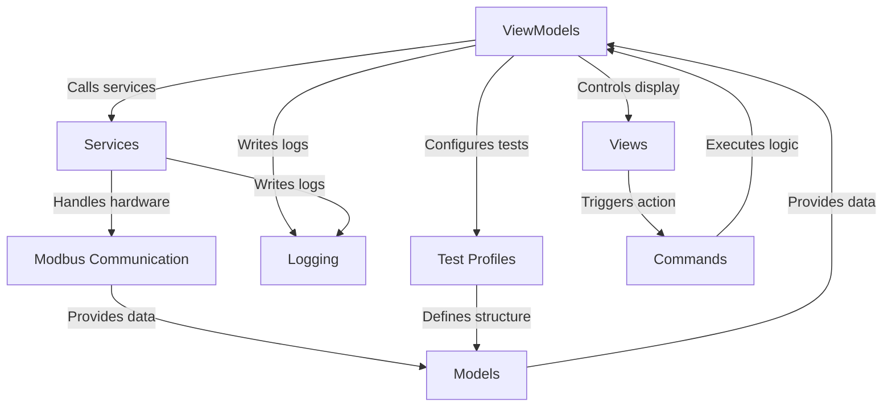

# Tutorial: RTL_v2

This project is a **test application** designed to interface with hardware **test stands** for different electronics boards. It allows users to **configure and run automated tests**, communicate with the hardware using *Modbus*, *log* events, generate *reports*, and *print labels* based on defined *test profiles*.

## Visual Overview

## Chapters

1. [Test Profiles
](01_test_profiles_.md)
2. [Models
](02_models_.md)
3. [Views
](03_views_.md)
4. [ViewModels
](04_viewmodels_.md)
5. [Commands
](05_commands_.md)
6. [Services
](06_services_.md)
7. [Modbus Communication
](07_modbus_communication_.md)
8. [Logging
](08_logging_.md)

---

Generated by [AI Codebase Knowledge Builder](https://github.com/The-Pocket/Tutorial-Codebase-Knowledge).
